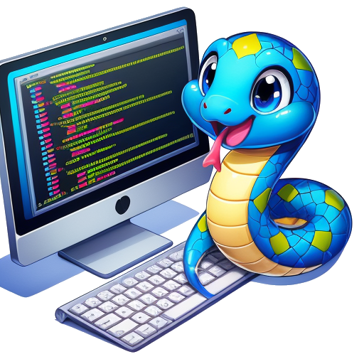

# Python 教程

## 潘多拉宝库传世，奥圣山神仙授石

列位看官：你道此书从何而来？

乾坤浩瀚，星河灿烂。在银河系边缘，悬浮着一颗名为 Pythora 的星球。其上生灵，无论草木虫鱼，抑或智人贤者，皆使用一种名为 Python 的语言互通心曲。在 Pythora，Python 并非仅是沟通的媒介，更是驱动万物之枢机：城市脉络般的交通网络，机器人大厨烹饪的珍馐佳肴，乃至星球四季更迭的天象变化，皆在其掌控之中。

Pythora 居民，自襁褓之时便浸润于 Python 的优美旋律之中。他们挥洒代码，如同吟诵诗篇，信手拈来，皆成华章。Python 于此，已臻艺术之境，代码之优雅与效率，乃是 Pythora 人民毕生追逐的荣光。每逢 “BUG 清零节”，编程大师们汇聚一堂，展示其鬼斧神工之作，畅谈对 Python 的独到见解，其景之盛，蔚为壮观。

然而，这个星球也有它的秘密。每当夜幕降临，星辉洒落，Pythora 的居民便会沉入梦乡。一股神秘力量操控着他们的意识，链接至圣山 OlymPyth 中的隐匿端口。在联机状态下，人们的编程效率扶摇直上，分布式并行运算可以在瞬息间攻克无数编程难题。梦境亦化为灵感的沃土，孕育出全新的编程思路与精妙算法。传说在圣山 OlymPyth 的深处，藏匿着一座古老的代码库，里面存储着所有 Python 之父留下的原始代码。得此代码者，得 Pythora。故此，无数朝圣者前赴后继，欲攀登圣山，寻觅秘藏，窥探 Python 的终极奥秘。

我踏着前人的足迹，在圣山脚下，徘徊寒暑十余载，终不得其要领。终于一日，我在幽邃密林之中，觅得一处前所未见的漏洞，得偿所愿，钻入了 OlymPyth 的腹地。待我步出洞穴之际，只见一位老者，须发皆白、仙风道骨，挡住去路。我赶忙趋步向前，恭敬问道：“仙长可知此山宝藏所在？”长者闻言，朗声大笑曰：“相逢即是缘份。然老朽俗事缠身，不便久留。吾有一石，乃鸿蒙初辟之际，坠落于此山青便峰下，自经煅炼，灵性已通。此石可解汝心中之惑，便赠与汝吧！”言罢，抬手指向身后一块巨石。我正欲拜谢，却见长者早已化作一串由 0 和 1 构成的流光，飘然散去了。

我敲了敲石头，问道：“石头兄，可愿为我讲讲这 Python 的奥妙之处吗？”石头道：“自然，自然。你且备好纸笔，我只说一次......”我赶紧掏出背包中的笔记本电脑，边听边记，一字不漏编绘成这本《Python 秘籍》。

## 内容简介

本书的阅读页面是： [https://py.qizhen.xyz](https://py.qizhen.xyz)。手机屏阅读的时候，查看全书目录需要点击一下页面左上角三根横线的那个按钮。需要搜索特定内容可以使用页面右上角的搜索框。有任何建议或问题，欢迎留言讨论。如果读者愿意，也可以点击每个页面左下角的编辑连接，直接编辑书中的内容。

全书分五个主要部分：

* Python 编程基础： 讲解了 Python 语言的核心语法和基础用法。通过这一部分的学习，可以掌握建立一个简单的小型程序所需的基本知识，如变量定义、基本数据类型、控制流语句等。
* 函数式编程： 介绍了函数式编程的概念和在 Python 中的应用。这一部分着重于高阶函数、闭包、装饰器等概念，通过函数式编程的思想，讲解如何编写更加简洁、高效的 Python 代码。
* 面向对象编程： 为了帮助理解和应用更复杂的程序设计模式，本部分深入探讨了面向对象编程的方法。内容涵盖类和对象的定义、继承、多态、封装等面向对象的基本原则，以及如何在 Python 中实现它们。
* 数据结构与算法： 虽然数据结构和算法是与具体编程语言无关的通用概念，但实现它们的代码却是最好的参考范例。这部分内容不仅覆盖了数据结构如列表、栈、队列、集合和字典等，还包括了搜索、排序等基础算法，目的在于帮助读者理解它们的工作原理并学会如何在实际中灵活运用。
* Python在特定领域的应用： Python 的应用实在是太广泛了，比如数据可视化、数据分析、网络编程、Web开发等。针对每个具体应用的介绍都显得非常零散，于是把它们都收录在“无所不能”的最后一部分。

书中所采用的示例程序，除了最简单的演示基本概念的示例之外，其它大多取材自常见的面试编程题目。

## 为什么要写一本 Python 的书？

毕竟，Python 的书太多了。而且，现在大家都看视频了，谁还看书呢？

在中国，我属于比较早就开始接触编程的了。上大学之前，我曾简单接触过 BASIC 语言，虽然连入门都不能算。真正开始系统学习编程还是在上大学之后，起步是从 Pascal 语言开始的。学生时代，我还学习了汇编、C、Scheme、MATLAB 等语言。步入职场后，主要使用的语言却都是学校里不曾教授过的，包括 C++、C#、LabVIEW、Java、PHP、JavaScript、Python 等。在学校时，教科书是我们的主要学习资源。工作初期，要学习一门新语言，我通常也会翻阅书籍。那时候，找到一本好书至关重要。记得当年，《Effective C++》 是我们学习 C++ 时的必读之作，而 《Design Patterns》 则指导了我们学习 Java 的道路。相比之下，我学习 JavaScript 和 Python 的时期稍晚，那时的学习方式已经革新了，搜索引擎成了我的主要学习工具。说来惭愧，我至今一本 JavaScript 或 Python 的书都还没看过，所有相关知识都是从 Google 上搜到的。

虽然书籍可能不再是我们获取知识的唯一途径了，但从我的经验来看，写作，或者说，记笔记，依然是学习过程中不可或缺的一环。亲手写过的知识，与仅仅阅读过的知识，掌握程度会截然不同。而把写好的文章发布出来，与人分享，则是写作的最强大动力。尤其对于我这种比较懒惰的人，非常需要这样一个外在目标驱动我不断学习。

今天，我们又一次站在了技术变革的门槛上。大语言模型很可能将取代搜索引擎，成为未来获取学习资料的主要途径。深入体验大语言模型为学习和写作带来的新机遇，也是我撰写此书的初衷之一。当我整理完书中的核心内容后，我将在本书的“[后记](epilogue)”中分享我对大语言模型的体验和感悟，作为整个写作过程的一个总结。

