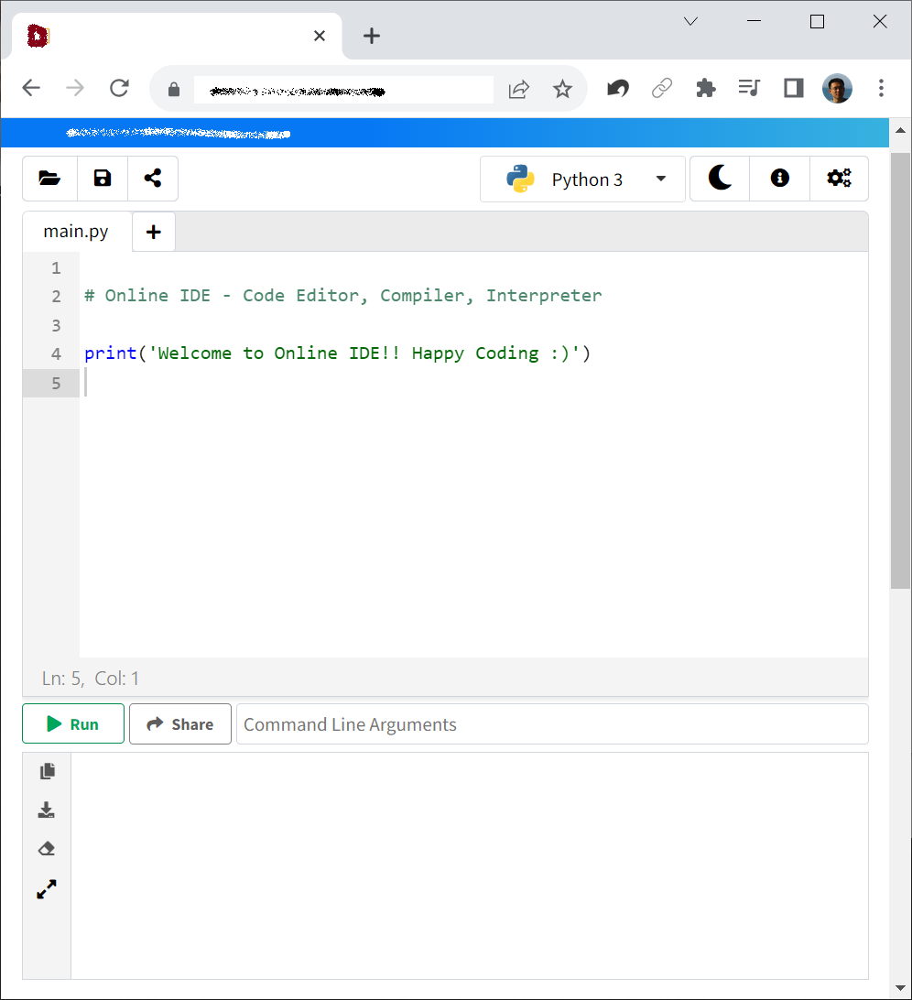
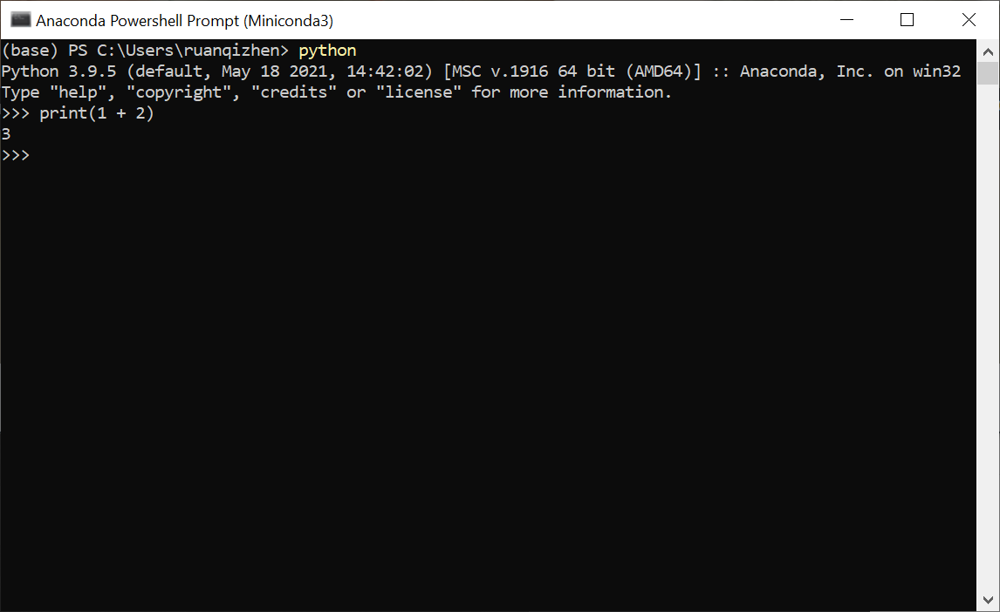
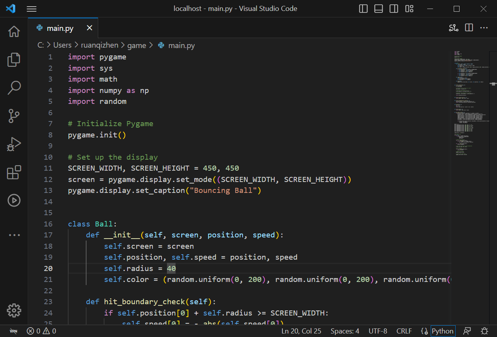
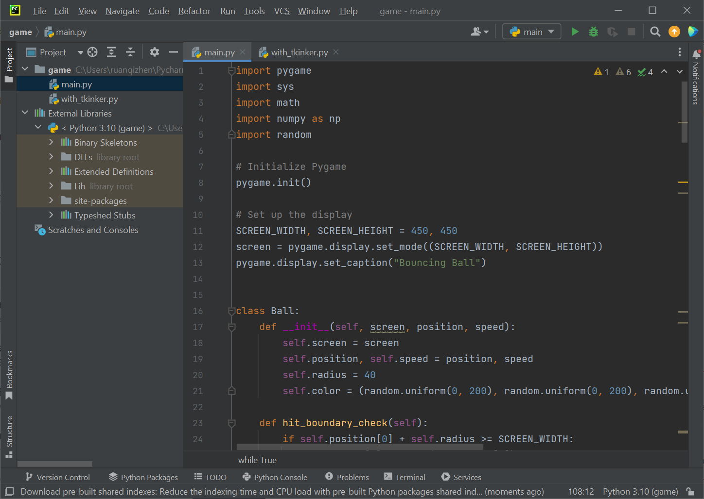

# Python 编程环境

最先考虑的当然是如何搭建一个可以编辑和运行 Python 程序的环境。这其实有几个不同的选择，读者可以根据自己的需求和偏好，选择几种不同的方式来编写 Python 程序，比如可以直接在某个网站上编写程序，或者采用传统的专业集成开发环境（IDE）编写程序，又或者自己搭建基于网页的编程环境编写程序。

## 公共的在线开发环境

在过去，想要编写、运行和测试代码，通常需要在本地机器上安装特定的编程环境和工具。但随着技术的发展，我们现在可以直接在浏览器中使用在线的集成开发环境（IDE）来编写、运行和测试代码。这样，我们不再需要在自己的电脑上安装任何软件或工具，打开一个网页，直接就可以编写运行程序了。Python 作为一种流行的编程语言，有许多针对其设计的在线 IDE。下面就来介绍如何使用在线 IDE 来编写 Python 程序。

如果读者还没有自己常用的在线 IDE，可以打开 Google 搜索“online IDE”，能够找到非常多的免费的在线编程网站，可以任意选择一个使用。
一个典型的在线编程环境的页面如下：



页面主要需要的区域是一个文本框，把程序写在这里就可以。
编写代码后，你会需要运行它来查看结果。在线 IDE 通常都有一个“运行”或“执行”按钮，点击它，IDE 会在其服务器上执行你的代码，并将输出显示在屏幕上。上图编辑环境的下半部分就是信息输出的文本框，用于观察程序运行的状态、结果等信息。

更高级的在线 IDE 会有登录选项，如果用户创建一个账户，则可以把自己的程序长期存放在网站上，甚至也可以直接把程序连接分享给别人。未登录用户需要注意，关闭网页后，自己写的程序可能会丢失，如果需要留档，需要自己把程序下载到本地计算机上。

目前，最著名的 Python 在线 IDE 是 [Google Colab](https://colab.research.google.com/ )，有很多开源项目就是在它上面进行开发和分享的。


## 安装 Python 解释器

安装 Python 解释器的过程非常简单，就不详细解释了。到 [Python 官网](https://www.python.org/downloads/ )，选择适当操作系统的最新版本的安装包，下载安装即可。

对于初学，这个基本的安装包就足够了。但是如果经来会在多个项目中使用到 Python，可能还要考虑不同版本的不同版本的 Python 和库等发生不兼容问题。比如，某个项目必须运行在 Python 3.9 而另一个项目必须运行在 Python 3.12；或者某个项目必须使用 PyTorch 1.x （这是一个 Python 的用于机器学习的扩展库），而另一个项目必须使用 PyTorch 2.x 等等。自己管理多个版本的 Python 和各种库的组合是非常麻烦的。所以，笔者建议最好使用专业的工具来管理所需的库和环境。

Python 最常用的环境管理工具是 Conda。在开源社区中最流行的包含 Conda 和 Python 的安装包是 [Miniconda](https://docs.conda.io/en/latest/miniconda.html )，和 [Anaconda](https://www.anaconda.com/ )。Miniconda 比较精简，安装包只包含了最核心的库，其它库可等到需要时再安装。它适合入门级的 Python 用户。Anaconda 的安装包比 Miniconda 大了大约十倍，包含了几乎所有常用的库，适合有大硬盘空间的用户使用。

在 Linux 上安装 Conda 后，Conda 在打开终端时就会自动启动。这时，用户会发现终端命名提示符的格式与之前不同了。如果不希望自动启动 Conda，可以使用如下命令将其关闭： 

```sh
conda config --set auto_activate_base false
```

在 Windows 上，需要通过 Conda 安装包创建的开始菜单启动带有 Conda 的 PowerShell，或命令行窗口。比如，在开始菜单里找到“Anaconda Prompt”，然后点击它启动 Conda。

比如，我们打算编写一个游戏，需要为它调用的 Python 程序创建一个独立新的环境，以避免它与其它 Python 程序有冲突。创建新环境使用 conda create 命名，同时为新的环境起名为 game，并设置新环境中 Python 的版本为 3.9：

```sh
(base) qizhen@deep:~$ conda create --name game python=3.9
```

使用 conda env list 命令可以列出所有已创建的环境。并且显示出每个环境所在的文件夹路径。我们需要记住这个路径，在配置 LabVIEW 调用 Python 代码时，会用到这一路径。

```sh
(base) qizhen@deep:~$ conda env list
# conda environments:
#
base                  *  /home/qizhen/anaconda3
game                     /home/qizhen/anaconda3/envs/game
```

上面列出的两个环境中，game 是新建的，base 是默认的环境。对新创建的环境进行配置或测试，需要首先切换到新环境。运行 conda activate 命令进行切换：

```sh
(base) qizhen@deep:~$ conda activate game
(game) qizhen@deep:~$ 
```

可以看到，命令提示中的环境名 (base) 已经被切换为 (game) 了。接下来我们就可以配置当前的环境，比如使用 pip 命令安装 Python 的库，或者运行某段 Python 代码。

## 传统的专业 IDE

Python 的解释器只提供了最简单的命令行界面。在命令行环境下运行“python”命令，就可以启动 Python 环境，然后输入代码运行：



这显然不是一个特别舒适的书写程序的环境。一个更好的方法是在读者最喜欢的文本编辑器中（比如，笔者最常用的文本编辑工具是 Notepad++）书写代码，写完全部代码后，调用 python 命令运行整个程序。市面上还存在着各式各样的专用于程序编辑的工具，它们比文本编辑器更适合编写程序。目前最流行的免费 Python IDE 是 Visual Studio Code（VS Code） 和 PyCharm。如果读者同时使用多种编程语言，VS Code 是一个非常好的选择，如果 Python　是读者唯一使用的编程语言，那么　PyCharm　会更加适合。

### Visual Studio Code （VS Code） 

VS Code 是一个轻量级、高度可配置的代码编辑器，支持各种语言和工具。在 [Visual Studio Code 官方网站](https://code.visualstudio.com/ )可以下载并安装 VS Code。　VS Code 可用于编写和运行多种编程语言的程序，针对 Python，在 VS Code 中，点击左侧工具栏的扩展图标（或按 Ctrl+Shift+X），然后搜索“Python”。选择由 Microsoft 提供的 Python 扩展并安装，就可以获得专为 Python 提供的语法高亮、智能感知、代码格式化、调试、Linting 等功能。
 
下图是在 VS Code 中打开的一个 Python 程序：



打开一个 Python 文件或新建一个。在文件右上角或底部状态栏，你可以选择 Python 解释器版本。点击它，然后选择与你的项目匹配的 Python 解释器。

现在，读者可以开始在 VS Code 中编写 Python 代码了。由于已经安装了 Python 扩展，你会在编写代码时得到自动完成、参数提示等功能的支持。

在 Python 文件编辑器的顶部，读者应该会看到一个绿色的运行按钮。点击它，就可以执行当前 Python 文件。读者也可以右键点击编辑器，然后选择“在 Python 终端中运行”来执行代码。

VS Code 也提供了调试，版本控制，虚拟环境管理等等几乎所有软件开发中常用的功能。另外 VS Code 社区提供了许多有用的扩展，帮助程序员处理 Python 项目，比如 Python Test Explorer 插件可以帮助运行和调试 Python 单元测试等。

### PyCharm

PyCharm 是 JetBrains 提供的一款专业的 Python IDE（集成开发环境），被广大开发者誉为 Python 开发的神器。它集成了许多强大的功能，包括代码补全、智能提示、调试、测试支持、版本控制等，使得 Python 开发变得高效和便捷。

从 [PyCharm 官方网站](https://www.jetbrains.com/pycharm/) 下载 PyCharm。PyCharm 提供了专业版（付费）和社区版（免费）两个版本。对于个人使用，免费社区版足够了。

PyCharm 的用法与 VS Code 非常类似，只是界面略有不同。在 PyCharm 中，可以创建多个 Python 项目，然后为每个项目选择合适的解释器和虚拟环境。除了运行、调试、代码管理等基本功能，PyCharm 也有大量的扩展插件可供选择。无论是新手还是资深开发者，PyCharm 都可以极大地提高 Python 开发的效率和质量。

下图是同样一段程序在 PyCharm 中打开：



## 基于网页的编程环境

传统的 IDE 往往是一个独立的用程序，但近些年，一类没有自己独立用户界面，依赖于网页浏览器提供界面的编程环境开始流行开来了。Jupyter Notebook 是这其中的典型代表。

Jupyter Notebook 是一个开源的交互式编程环境。它本身不是一个应用程序，而是一个网页服务，启动这个服务，就可以在网页浏览器中，打开相关的网页，编辑运行程序了。与传统的 IDE 相比，它有几个非常显著的优点： 

* 交互式编程： 它把程序代码分隔成很多单元格，每个单元格的代码可以独立运行，并立刻看到输出结果，这对于数据分析和可视化非常有用。
* 富文本支持： 可以使用 Markdown 和 LaTeX 来格式化文本和方程式，产生具有不同字体，格式的文本，也可以嵌入图片、视频等。真正做到了程序与文档融合为一体。
* 便于分享： 它的富文本格式内容可以导出为多种文档格式，如 PDF、HTML 等，方便分享报告和分析结果。并且它本身就是一个网页服务，可以轻松的让其他人访问本地的程序内容。
* 支持多种编程语言： 虽然传统 IDE 也可以支持多种编程语言，但是 Jupyter Notebook 极其衍生产品又更进一步，可以在同一个文件中就集成多种不同编程语言的代码。它可以用一种编程语言运行程序的前一段，在用另一种语言运行程序的后一段。

其它的传统 IDE 具备的优点，比如，插件扩展、跨平台等，Jupyter Notebook 也同样都具备。

Jupyter Notebook 尤其受到数据科学家、研究人员和学者的欢迎。笔者平时在从事数据统计、机器学习等类型的项目时，也是倾向于使用 Jupyter Notebook 进行开发。当然它也并非没有缺点，它不适合用于用户界面、网络应用等的开发，在处理这一类项目时，笔者还是倾向于使用传统 IDE。

下图是使用 Jupyter Notebook 打开的一段程序：


### 安装与使用：

安装 Jupyter Notebook 之前，先要安装 Python 解释器。之后，就可以使用 Python 自带的安装包管理工具 pip 来安装 Jupyter Notebook 了。打开计算机的命令行终端，输入下面的命令：

```sh
pip install notebook
```

如果读者使用了上文提到的 Anaconda 安装 Python，Jupyter Notebook 和其他一些常用的科学计算工具就都已经自动包含在内安装好了。

在命令行或终端中，输入以下命令，将会启动一个编程所需的网页服务：

```sh
jupyter notebook
```

它会在你的默认浏览器中打开一个 Jupyter Notebook 实例，并显示文件和文件夹列表。如果网页没有自动打开，活不小心被关闭了，读者也可以自己打开浏览器，输入网址： http://localhost:8888/ 重新打开编程页面。

在打开的主页面上，点击“New”按钮，选择你的目标编程语言，如 Python 3，就可以创建一个新的程序。我们称每个程序为一个“Notebook”。在新的 Notebook 中，你可以输入 Python 代码并点击“Run”按钮（或按 Shift + Enter）执行。点击页面上方的“+”按钮可以添加新的单元格。你可以在单元格中选择“Markdown”模式，然后输入 Markdown 文本或 LaTeX 方程。点击页面上方的保存按钮（或按 Ctrl + S）可以保存当前的程序。如果需要退出编程环境，可以关闭浏览器标签后，回到命令行并按 Ctrl + C 终止 Jupyter Notebook 服务。

Jupyter Notebook 保存下来的程序的后缀名不是 .py 而是 .ipynb。 这是因为，这个文件中不但要保存程序代码，还会保存程序的运行结果，富文本文档等内容。不过在 Jupyter Notebook 的菜单选项中，可以导出并保存一个只包含代码的 .py 文件。
