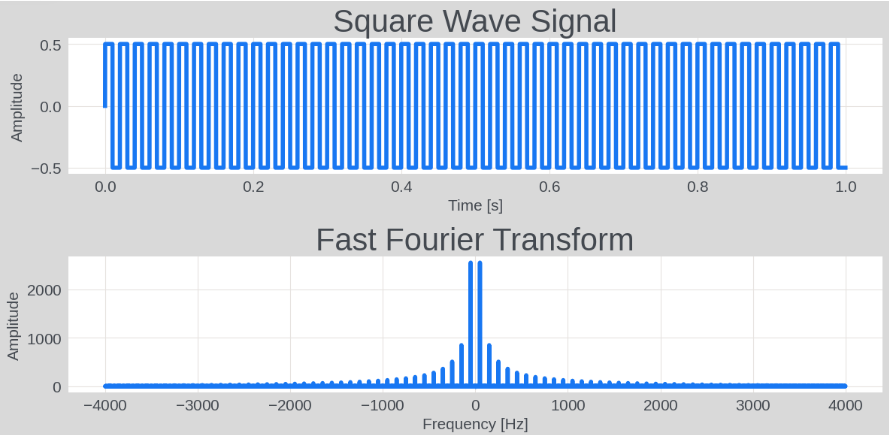

# 矩阵计算和 NumPy

NumPy（Numerical Python的缩写）是一个开源的 Python 库，广泛应用于科学计算中，特别是在数组计算、线性代数、傅里叶变换和随机数生成等领域。它提供了一个强大的 N 维数组对象和大量用于操作这些数组的函数和工具。很多高级科学计算工具包，比如 Pandas、Matplotlib 等都是基于 NumPy 的。

## 安装

NumPy 是个第三方包，如果还没有安装NumPy，可以通过以下命令安装：

```sh
pip install numpy
```

使用 NumPy 功能先要导入：

```python
import numpy as np
```

下面示例代码，有些省略了导入过程了，测试时需要自行添加。

## 数组

NumPy 的核心特性之一是其 N 维数组（ndarray）对象。这是一个快速、灵活的大数据集容器。与 Python 原生的列表相比，NumPy 的数组更加高效，支持更高级的数学运算。下面是一些常用的数组操作。

### 创建数组

使用 np.array 函数，可以把其它类型的数据转换成 NumPy 数组：

```python
# 把列表转换成数组
np_array = np.array([1, 2, 3, 4, 5])

# 把图片转换成二维数组
from PIL import Image
image = Image.open("example.jpg")
image_array = np.array(image)
```

使用 np.zeros，np.ones 函数可以创建特定大小的全零或全一数组：

```python
zeros_array = np.zeros((2, 3))  # 创建一个 2x3 的零矩阵
ones_array = np.ones((3, 4))    # 创建一个 3x4 的单位矩阵
range_array = np.arange(10)     # 创建一个元素值从 0 到 9 的数组
random_array = np.random.randint(0, 10, (3, 4))  # 创建一个 3x4 的矩阵，元素都是 0 到 9 的随机整数
```

### 数组形状和大小

shape 属性表示了数组形状：

```python
import numpy as np
ones_array = np.ones((3, 4)) 
print(ones_array.shape)         # 输出： (3, 4)
```

reshape 可以改变数组形状：

```python
import numpy as np

# 创建一个一维数组
arr = np.arange(10)  # 这将创建一个包含数字0到9的数组
print("原始数组:")
print(arr)

# 使用reshape将其重新排列成一个2x5的二维数组
reshaped_arr = arr.reshape((2, 5))
print("\n重塑后的二维数组:")
print(reshaped_arr)

# 也可以让NumPy自动计算其中一个维度的大小
# 下面的-1表示自动计算该维度的大小
reshaped_arr_2 = arr.reshape((5, -1))
print("\n自动计算维度的重塑数组:")
print(reshaped_arr_2)
```

输出：

```
原始数组:
[0 1 2 3 4 5 6 7 8 9]

重塑后的二维数组:
[[0 1 2 3 4]
 [5 6 7 8 9]]

自动计算维度的重塑数组:
[[0 1]
 [2 3]
 [4 5]
 [6 7]
 [8 9]]
```

### 索引和切片

NumPy 一维数组索引方式与列表索引相同：

```python
element = np_array[0]  # 获取第一个元素
```

但是二维或更高维就不同了，对于二维数组（矩阵），索引方式通常是 `array[row, column]`：

```python
# 创建一个 3x3 的二维数组
arr = np.array([[1, 2, 3], [4, 5, 6], [7, 8, 9]])

# 访问第二行第三列的元素
print(arr[1, 2])  # 输出 6
```

NumPy 数组同样支持切片操作，规则与列表的切片相同：

```python
# 访问第二行
print(arr[1, :])  # 输出 [4 5 6]

# 访问第三列
print(arr[:, 2])  # 输出 [3 6 9]

# 访问子矩阵（前两行，前两列）
print(arr[:2, :2])  # 输出 [[1 2] [4 5]]
```

NumPy 支持整数数组索引，可用来索引另一个数组：

```python
print(arr[[0, 2], [1, 2]])  
# 输出 [2 9]  也就是索引了两个数 arr[0, 1] 和 arr[2, 2]
```

NumPy 还支持布尔索引，根据数组中元素的条件来索引：

```python
# 创建一个布尔数组，表示元素是否大于5
bool_idx = arr > 5

# 使用布尔数组进行索引
print(arr[bool_idx])  # 输出 [6 7 8 9]
```

## 矩阵运算

NumPy 实现了所有常用的数学运算，我们无法一一介绍，这里着重演示一下，NumPy 最主要功能，矩阵的基本运算。

### 四则运算

最基础的自然是加减乘除：

```python
import numpy as np

# 创建两个矩阵
A = np.array([[1, 2], [3, 4]])
B = np.array([[5, 6], [7, 8]])

# 矩阵加法
addition = A + B
print("矩阵加法 A + B:\n", addition)

# 矩阵减法
subtraction = A - B
print("\n矩阵减法 A - B:\n", subtraction)

# 矩阵乘法（叉乘）
elementwise_multiplication = A * B
print("\n矩阵叉乘 A * B:\n", elementwise_multiplication)

# 矩阵乘法（点乘）
dot_product = np.dot(A, B)
print("\n矩阵点乘 A dot B:\n", dot_product)

# 矩阵除法（元素对元素）
elementwise_division = A / B
print("\n矩阵元素对元素除法 A / B:\n", elementwise_division)
```

输出：

```
矩阵加法 A + B:
 [[ 6  8]
 [10 12]]

矩阵减法 A - B:
 [[-4 -4]
 [-4 -4]]

矩阵叉乘 A * B:
 [[ 5 12]
 [21 32]]

矩阵点乘 A dot B:
 [[19 22]
 [43 50]]

矩阵元素对元素除法 A / B:
 [[0.2        0.33333333]
 [0.42857143 0.5       ]]
```

### 轴操作

在多维数据处理中，我们经常要沿着特定的轴（或维度）执行一些计算，例如计算总和、平均值、最大值和最小值等。以下是一些矩阵轴操作的示例程序。

```python
import numpy as np

# 创建一个 3x3 的矩阵
matrix = np.array([[1, 2, 3], [4, 5, 6], [7, 8, 9]])

# 计算所有元素的总和
total_sum = np.sum(matrix)
print("矩阵所有元素的总和:", total_sum)

# 计算每列的总和
col_sum = np.sum(matrix, axis=0)
print("每列的总和:", col_sum)

# 计算每行的总和
row_sum = np.sum(matrix, axis=1)
print("每行的总和:", row_sum)

# 计算每列的平均值
col_mean = np.mean(matrix, axis=0)
print("每列的平均值:", col_mean)

# 计算每行的平均值
row_mean = np.mean(matrix, axis=1)
print("每行的平均值:", row_mean)

# 计算每列的最大值
col_max = np.max(matrix, axis=0)
print("每列的最大值:", col_max)

# 计算每行的最大值
row_max = np.max(matrix, axis=1)
print("每行的最大值:", row_max)
```

### 线性代数操作

矩阵乘法、求逆等

```python
import numpy as np

# 创建两个矩阵
A = np.array([[1, 2, 3], [4, 5, 6], [7, 8, 9]])
B = np.array([[9, 8, 7], [6, 5, 4], [3, 2, 1]])

# 矩阵转置
transpose_A = A.T
transpose_B = B.T

# 尝试求矩阵A的逆（如果可能）
try:
    inverse_A = np.linalg.inv(A)
except np.linalg.LinAlgError:
    inverse_A = "不可逆"

# 打印结果
print("矩阵 A:\n", A)
print("矩阵 B:\n", B)
print("A 的转置:\n", transpose_A)
print("B 的转置:\n", transpose_B)
print("A 的逆:\n", inverse_A)
```

### 快速傅立叶变换

快速傅立叶变换（Fast Fourier Transform，FFT）算法用于将信号在时域和频域之间进行转换。这一算法广泛应用于信号处理、图像处理、音频分析和许多其他领域。

```python
import numpy as np
import matplotlib.pyplot as plt

# 创建一个方波信号
Fs = 8000   # 采样频率
f = 50      # 信号频率
t = np.linspace(0, 1, Fs, endpoint=False)  # 时间轴
# signal = 0.5 * np.sin(2 * np.pi * f * t)  # 生成正弦波
signal = 0.5 * np.sign(np.sin(2 * np.pi * f * t))  # 生成方波

# 快速傅立叶变换
fft_result = np.fft.fft(signal)
fft_freq = np.fft.fftfreq(t.shape[-1], d=1/Fs)

# 绘图
plt.figure(figsize=(12, 6))

# 绘制原始信号
plt.subplot(2, 1, 1)
plt.plot(t, signal)
plt.title('Square Wave Signal')
plt.xlabel('Time [s]')
plt.ylabel('Amplitude')

# 绘制FFT结果
plt.subplot(2, 1, 2)
plt.plot(fft_freq, np.abs(fft_result))
plt.title('Fast Fourier Transform')
plt.xlabel('Frequency [Hz]')
plt.ylabel('Amplitude')

plt.tight_layout()
plt.show()
```

结果：




## 数组广播

NumPy 的数组广播（Broadcasting）允许 NumPy 在执行数组运算时自动处理不同形状（Shape）的数组，而无需显式地调整它们的形状。

### 广播的规则

数组广播遵循一组特定的规则来应用操作：
1. 扩展维度： 如果两个数组的维度数不同，那么小维度数组的形状将会在前面补 1，直到与大维度数组的维数相同。
2. 扩展大小： 在任何一个维度上，如果一个数组的大小为 1，而另一个数组的大小大于 1，那么首先会将小数组沿该维度“扩展”来匹配大数组的形状。扩展仅仅是一个概念上的复制，不会进行实际的数据复制。
3. 维度不匹配时报错： 如果两个数组在任何维度上都大小不一致，且大小都不为 1，则会引发错误。

### 加法

假设我们有一个 2x3 的数组 A 和一个 1x3 的数组 B，我们想将这两个数组相加，B 的形状被扩展为 2x3，然后与 A 相加：

```python
A = np.array([[1, 2, 3], [4, 5, 6]])
B = np.array([1, 2, 3])

# B 会在第一个维度上被“扩展”，以匹配 A 的形状
C = A + B

# 结果： C = [[2, 4, 6], [5, 7, 9]]
```

### 乘法

假设我们有一个 3x1 的数组 A 和一个标量 B 相乘，B 会被广播成一个 3x1 的数组，然后逐元素地乘以 A：

```python
A = np.array([[1], [2], [3]])
B = 2

# B会被广播到 3x1，然后与 A 相乘
C = A * B

# 结果： C = [[2, 4, 6]]
```

### 优缺点

广播机制的主要优势是它可以提高代码的性能和可读性。可以不需要编写额外的代码来处理不同形状的数组，NumPy 会自动、高效地处理它们。这使得可以避免显式地使用循环来进行数组操作，从而在保持代码简洁的同时提高执行效率。

尽管广播非常有用，但错误地理解或应用广播规则可能会导致意外的行为和错误。特别是在处理多维数据时，始终要清楚每个操作的广播机制是如何应用的。

## 丰富的数值类型

NumPy 支持更多种类的数值类型，比 Python 内置的类型更丰富，这对于科学计算尤其重要。它们的命名规则非常直观，比如： np.int8 表示 8 位有符号整数，范围是 -128 到 127； np.uint64 表示 64 位无符号整数； np.float16 表示半精度浮点数等。

使用 NumPy 时，通常可以让 NumPy 自动选择最合适的数据类型，但在需要优化内存使用或确保数值精度的情况下，也可以显式指定使用这些类型中的哪一种。例如：

```python
arr = np.array([1, 2, 3], dtype=np.float32)  # 创建一个float32类型的数组
```

选择正确的数据类型对于优化性能和内存使用非常重要，特别是在处理大型数组或进行复杂数值计算时。比如在训练人工神经网络模型时，经常会把参数精度设置为 np.float16。


## 占位符

在 Python 中，为了保持语法正确，有时候需要添加一些没有意义的占位符在代码中。

### 下划线

下划线 `_` 通常用作临时或不重要的变量，比如在循环或迭代中，当某个变量是必需的但不会在后续代码中使用时，可以使用 _ 作为变量名：

```python
# 对列表中的每个元素执行某个操作，但实际上不需要使用元素本身
for _ in range(5):
    print("重复执行")

# 解包时忽略某些值
a, _, b = (1, 2, 3)  # a = 1, b = 3
```

### pass

我们之前已经使用过 pass 无数次了，它是一个空操作语句，当语法上需要一条语句但程序逻辑不需要任何动作时，可以使用 pass。它通常用于定义尚未实现的代码块，例如在函数、循环、条件判断等结构中，也可以用于避免语法错误：当一个语句是必需的但又不想执行任何代码时。比如：

```python
def my_func():
    pass

print(my_func())
```

在上面代码中，还没有想好如何实现 my_func，但它又不能空着，于是放了一个 pass。

### Ellipsis

Python 中还有一种更省事的占位符，三个点： `...`，比如：

```python
def my_func():
    ...

print(my_func())
```

效果与使用 pass 是相同的。但他们也有不同之处，pass 是一个语句，而 `...` 是一个特殊的值。我们不能写 `return pass`，但可以 `return ...`：

```python
def my_func():
    return ...

print(my_func())  # 输出： Ellipsis
```

上面的程序输出是 Ellipsis， `...` 这个值的正式名就是 Ellipsis。Ellipsis 是一个内置的特殊值，除了用作占位符，还通常在切片操作中使用，表示未完全指定的切片。也就是使用 `...` 替代几个连续的 `:,` 符号，比如：

```python
import numpy as np

# 创建一个四维数组，形状为 2*3*4*5*6
arr = np.arange(120).reshape(2, 3, 4, 5)

# 使用 Ellipsis 选择全部元素，相当于 arr[:, :, :, :]
print(arr[...])   # 会把整个四位数组打印出来，数据从 0 到 119

# 使用 Ellipsis 选择最后一个维度上索引为 0 的所有元素，相当于 arr[:, :, :, 0]
print(arr[..., 0])

# 输出：
# [[[  0   5  10  15]
#   [ 20  25  30  35]
#   [ 40  45  50  55]]
# 
#  [[ 60  65  70  75]
#   [ 80  85  90  95]
#   [100 105 110 115]]]


# 使用 Ellipsis 选择第一个和最后一个维度上索引为 1 的所有元素，相当于 arr[1, :, :, 1]
print(arr[1, ..., 0])

# 输出：
# [[ 60  65  70  75]
#  [ 80  85  90  95]
#  [100 105 110 115]]
```

因为 `...` 省略的是不定数量的维度，所以切片操作中不能有多个 `...`，那样会引起歧义。

