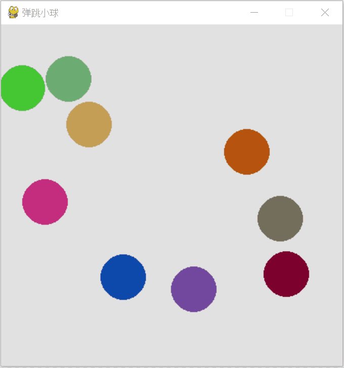

# 简单动画和 Pygame

这一节的目标是在屏幕上绘制多个可以移动的刚性小球，它们之间会碰撞反弹。用于演示初中物理中讲解的动量守恒原理。Python 中有很多库都可以用来实现动画，比如上文介绍的 Tkinter。这一节着重介绍一下 Pygame 库。

## Pygame 库

Pygame 顾名思义，是专为电子游戏设计的。它提供了创建游戏所需的图形和声音库。它允许用户快速地开发游戏，而不需要从头开始编写底层的代码。Pygame 基于 SDL（Simple DirectMedia Layer），这是一种跨平台的多媒体库，用于处理视频、声音、输入设备、和 CD-ROM 等。

Pygame 不是 Python 自带的，需要额外安装，可以通过 Python 的包管理器 pip 来安装 Pygame：

```bash
pip install pygame

```

一旦安装好了，就可以导入 pygame 模块并开始编写游戏代码了。我们使用一个简易的小游戏来介绍一下如何使用 pygame。

## 简单游戏

假设，我们要编写一个简单的小游戏：屏幕上，有一个小球随机落下，频幕下方，用户可以控制一个水平移动的木板。如果木板接住小球，小球就会弹起，否则小球落下，游戏结束。下面是这个游戏的程序：

```python
import pygame
import random

# 初始化 pygame
pygame.init()

# 设置屏幕尺寸
screen_width = 600
screen_height = 400
screen = pygame.display.set_mode((screen_width, screen_height))
pygame.display.set_caption("接球小游戏")

# 颜色定义
PADDLE_COLOR = (100, 200, 100)
SCREEN_COLOR = (10, 10, 10)
BALL_COLOR = (200, 30, 30)

# 游戏变量
ball_radius = 15
ball_speed = 3
paddle_width = 100
paddle_height = 20
paddle_speed = 5

# 初始化木板位置 (Rect 对象)
paddle = pygame.Rect(screen_width // 2 - paddle_width // 2, screen_height - 40, paddle_width, paddle_height)

# 初始化球的位置 (Rect 对象，用于碰撞检测)
ball = pygame.Rect(random.randint(ball_radius, screen_width - ball_radius), 0, ball_radius * 2, ball_radius * 2)
ball_dx = random.choice([-1, 1]) * ball_speed
ball_dy = ball_speed

# 游戏循环标志
running = True
clock = pygame.time.Clock()

# 游戏主循环
while running:
    # 1. 处理事件
    for event in pygame.event.get():
        if event.type == pygame.QUIT:
            running = False

    # 2. 处理用户输入
    keys = pygame.key.get_pressed()
    if keys[pygame.K_LEFT]:
        paddle.x -= paddle_speed
        if paddle.left < 0:
            paddle.left = 0
    if keys[pygame.K_RIGHT]:
        paddle.x += paddle_speed
        if paddle.right > screen_width:
            paddle.right = screen_width

    # 3. 更新游戏状态
    # 移动球
    ball.x += ball_dx
    ball.y += ball_dy

    # 墙壁碰撞检测
    if ball.left <= 0 or ball.right >= screen_width:
        ball_dx *= -1
    if ball.top <= 0:
        ball_dy *= -1
    
    # 木板碰撞检测
    if ball.colliderect(paddle) and ball_dy > 0:
        ball_dy *= -1

    # 检查球是否掉出屏幕底部
    if ball.bottom >= screen_height:
        print("游戏结束！")
        running = False

    # 4. 绘制
    screen.fill(SCREEN_COLOR)  # 使用黑色填充屏幕 (清屏)
    pygame.draw.ellipse(screen, BALL_COLOR, ball)  # 绘制红色的球
    pygame.draw.rect(screen, PADDLE_COLOR, paddle)  # 绘制黄绿色的木板

    # 5. 更新屏幕显示
    pygame.display.flip()
    
    # 控制帧率 (60 FPS)
    clock.tick(60)

# 退出游戏
pygame.quit()

```

在上面的程序中，导入 pygame 模块后，先要调用 `init()` 方法对其初始化。然后使用 `display.set_mode()` 方法，设置游戏窗口的尺寸。

程序设定了一些游戏中的常数和变量，比如球的颜色，运动速度等。其中 `pygame.Rect` 是一个类，它用来存储和操作矩形区域的坐标和尺寸。这个类在游戏开发中非常有用，因为它提供了一种简便的方式来跟踪游戏元素（如角色、障碍物、按钮等）的位置和大小，并且可以轻松地用来检测碰撞和进行界面布局。我们为游戏中的两个物体，球和木板都定义为了 `Rect` 的对象。

pygame 提供了绘制简单形状的函数，比如绘制圆球，可以使用 `draw.ellipse()` 方法；绘制矩形木板，可以使用 `draw.rect()` 方法。pygame 在绘制图形时，并不会直接绘制到屏幕上，因为这样会影响动画效果。它首先把所有需要绘制的图形都绘制在**缓冲区**里，当调用 `display.flip()` 方法时，再把已经绘制好的图案显示到屏幕上，这样就不容易出现闪烁、残影等问题了。

在程序运行的主循环中，一直在检测用户是否有按下左右箭头按键，如果有，则会相应改变木板的位置。同时，程序也在一直监视小球的位置，如果小球与墙壁或木板发生碰撞，则改变它的速度，让它反弹。

## 生成随机数

多数程序不需要有随机因素，它们需要的是准确的结果。但是随机对于游戏却非常重要。用户不会喜欢每次打开游戏，看到的过程都是一模一样的，他们需要一些不可预期的新奇感。这时候，随机数就派上用场了。

在 Python 中生成随机数的主要方式是通过内置的 `random` 模块，这个模块提供了多种生成随机数的函数。下面是一些最常用的功能：

* `random.random()`: 返回一个 0 到 1 之间的随机浮点数，其中包括 0 但不包括 1。
* `random.uniform(a, b)`: 返回一个指定范围内的随机浮点数，范围由参数 a 和 b 定义，其中包括 a 但不包括 b。
* `random.randint(a, b)`: 返回一个指定范围内的随机整数，范围由参数 a 和 b 定义，包括两端的边界值。
* `random.choice(sequence)`: 从一个非空序列中返回一个随机元素。
* `random.shuffle(sequence)`: 将序列随机打乱位置。
* `random.sample(population, k)`: 从总体序列或集合中选择 k 个唯一的随机元素。

```python
import random

# 定义一个列表
my_list = ['apple', 'banana', 'cherry', 'date', 'elderberry', 'fig', 'grape']

# 使用random.shuffle打乱列表
random.shuffle(my_list)

# 打印打乱后的列表
print("Shuffled list:", my_list)

# 使用 random.sample 随机选择 3 个元素
selected_items = random.sample(my_list, 3)

# 打印选择的元素
print("Selected items:", selected_items)

```

运行上面的程序，每次都会看到不一样的结果。

## 多个球运动

回到本节最初的那个问题：“绘制多个可以移动的刚性小球，它们之间会碰撞反弹。”由于有多个球，我们可以定义一个球的类，包含所有球的属性和方法，然后让每个球都是一个实例。

另一个麻烦的地方是，两球碰撞后的速度如何改变。它们的速度大小方向，碰撞位置都可能不同。如果只采用简单规则，像上面示例那样，球的运动看起来就会特别不真实。所以，在程序里，我们定义了一些向量运算，它们的目的是当两球相撞时，把两个球的速度都分解为两个向量，一个是沿着两球连线方向的运动分量，另一个是垂直于两球连线方向的运动分量。假设所有球的质量相同，那么按照动量守恒定理，两个球沿着连线方向上的运动分量应该互换，而垂直于连线方向上的运动分量保持不变。在做完上述计算后，在把每个球的两部分运动分量转换成沿着 x 和 y 坐标轴上的分量，就可以继续了。

这个程序如下：

```python
import pygame
import sys
import math
import numpy as np
import random

# 初始化 Pygame
pygame.init()

# 设置显示屏幕的大小
SCREEN_WIDTH, SCREEN_HEIGHT = 450, 450
screen = pygame.display.set_mode((SCREEN_WIDTH, SCREEN_HEIGHT))
pygame.display.set_caption("弹跳小球")  # 窗口标题

# 定义球类
class Ball:
    def __init__(self, screen, position, speed):
        self.screen = screen  # 绘图表面
        self.position = np.array(position, dtype=float)  # 位置 (x, y)
        self.speed = np.array(speed, dtype=float)        # 速度 (vx, vy)
        self.radius = 30  # 球的半径
        # 球的颜色，随机生成
        self.color = (random.randint(0, 255), random.randint(0, 255), random.randint(0, 255))

    # 检查球是否撞到边界
    def hit_boundary_check(self):
        # 如果球撞到左右边界
        if self.position[0] + self.radius >= SCREEN_WIDTH:
            self.speed[0] = -abs(self.speed[0])
        elif self.position[0] - self.radius <= 0:
            self.speed[0] = abs(self.speed[0])
            
        # 如果球撞到上下边界
        if self.position[1] + self.radius >= SCREEN_HEIGHT:
            self.speed[1] = -abs(self.speed[1])
        elif self.position[1] - self.radius <= 0:
            self.speed[1] = abs(self.speed[1])

    # 更新球的位置
    def update(self):
        self.hit_boundary_check()  # 检查球是否撞到边界
        self.position += self.speed # 移动

    # 绘制球到屏幕上
    def draw(self):
        pygame.draw.circle(screen, self.color, self.position.astype(int), self.radius)  # 在屏幕上绘制球


# 碰撞检测与处理函数
def hit_others_check(a, b):
    # 计算两球中心的距离
    dist_vec = a.position - b.position
    dist = np.linalg.norm(dist_vec)
    
    # 如果两个球之间的距离小于它们半径之和，说明它们发生了碰撞
    if dist <= a.radius + b.radius:
        # 计算碰撞法线方向（连心线方向）
        normal = dist_vec / dist
        
        # 计算相对速度
        relative_velocity = a.speed - b.speed
        
        # 计算相对速度在法线方向上的投影
        velocity_along_normal = np.dot(relative_velocity, normal)
        
        # 如果速度方向是分离的，则不需要处理（避免粘连）
        if velocity_along_normal > 0:
            return

        # 简单的动量守恒（假设质量相等）：交换法线方向的速度分量
        # 实际上就是各自反弹
        a.speed -= velocity_along_normal * normal
        b.speed += velocity_along_normal * normal


balls = []  # 创建9个球的实例并设置初始位置和速度
balls.append(Ball(screen, [100, 100], [3, 0]))
balls.append(Ball(screen, [100, 200], [-2, -2]))
balls.append(Ball(screen, [100, 300], [0, 3]))
balls.append(Ball(screen, [200, 100], [-1, -2]))
balls.append(Ball(screen, [200, 200], [-2, -1]))
balls.append(Ball(screen, [200, 300], [0, 3]))
balls.append(Ball(screen, [300, 100], [1, 2]))
balls.append(Ball(screen, [300, 200], [4, 4]))
balls.append(Ball(screen, [300, 300], [2, 1]))

number_balls = len(balls)
clock = pygame.time.Clock()

# 主游戏循环
while True:
    for event in pygame.event.get():
        # 如果点击关闭窗口则退出游戏
        if event.type == pygame.QUIT:
            pygame.quit()
            sys.exit()

    # 1. 物理计算
    # 检查球之间的碰撞并更新速度
    for i in range(number_balls):
        for j in range(i + 1, number_balls):
            hit_others_check(balls[i], balls[j])

    # 更新所有球的位置
    for i in range(number_balls):
        balls[i].update()

    # 2. 绘制
    # 用白色填充整个屏幕背景
    screen.fill((225, 225, 225))

    # 绘制所有的球
    for i in range(number_balls):
        balls[i].draw()

    # 3. 刷新屏幕显示
    pygame.display.flip()

    # 控制帧率 (30 FPS)
    clock.tick(30)

```

程序运行结果大致如下：


