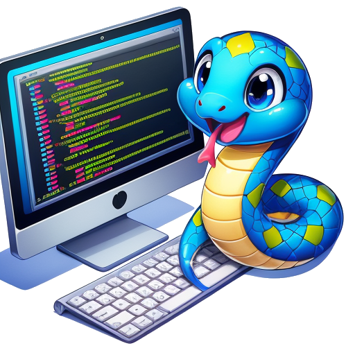

# Python Tutorial

## How the Treasure of Pythora Was Revealed

You might be wondering how this book found its way into your hands.

Far beyond the edge of the known heavens, drifting in a quiet river of stars, lies the planet Pythora.

On Pythora, every living thing—from the smallest insect to the mightiest beast—communicates in a language known as Python. But Python is more than mere speech there; it is the fundamental infrastructure of their reality. It guides their trade routes, powers their cities, and dictates the weather. Even the turning of the seasons is governed by elegant lines of code.

To the people of Pythora, programming isn’t just a technical trade—it is a high art form. They learn it the moment they learn to speak. A well-crafted function is admired like a sonnet, and an elegant algorithm is celebrated like a masterwork of music.

Each year, the planet’s greatest minds convene at the Great Debug Festival. Programmers from every corner of the globe gather to debate architecture, refine logic, and compete to solve the impossible. To an outsider, it wouldn't look like a technology conference at all; it would look like a conclave of wizards.

Yet, beneath this shining civilization lies an ancient mystery.

Legend has it that in the deep of the night, while the planet sleeps, dreaming minds are quietly drawn toward a hidden gateway buried inside the sacred mountain of OlymPyth. At the heart of that mountain rests a treasure older than memory: the Original Kernel, left behind by the legendary Creator. It is said that whoever uncovers it will gain ultimate comprehension of the language and mastery over every system built upon it.

For centuries, scholars, seekers, and dreamers have attempted the ascent. Few ever returned with answers.

I was one of those seekers.

For ten long years, I wandered the foothills of OlymPyth. I studied forgotten manuscripts and traced abandoned code paths, searching for a way inside. My efforts yielded nothing—until one extraordinary afternoon.

Deep within a forest of tangled logic, I stumbled upon a flaw in reality itself: a tiny crack in the system's boundary. Curiosity overcoming caution, I squeezed through the opening and found myself standing inside the hollow mountain.

There, at the end of a vast cavern illuminated by streams of cascading symbols, stood an old man. His hair was white as snow, but his eyes sparked with a sharp, youthful energy.

I bowed. “Master,” I asked, “do you know where the treasure lies?”

The old man chuckled.

“Perhaps,” he replied. “But my memory is running out of space, and my underlying process is nearly complete. I cannot remain in this loop much longer.”

He pointed to a massive stone resting against the cavern wall.

“This stone,” he said softly, “fell into the world during the very first moments of creation, while the system was still booting. It spent ages buried beneath the slopes of Legacy Code Mountain, quietly absorbing the secrets of the universe. It knows more than any living scholar. Perhaps it can answer the questions you carry.”

Before I could thank him, his form dissolved into a shower of glowing ones and zeros, drifting upward before vanishing into the dark.

I turned to face the stone. Tentatively, I knocked on its rough surface.

“Stone,” I asked, “will you teach me the mysteries of Python?”

The stone rumbled deeply, its voice vibrating through the cavern.

“Certainly,” it replied. “But listen carefully. My runtime is limited, and I will only execute this explanation once.”

Panicking slightly, I flipped open my laptop and began to type as fast as humanly possible.

Those frantic notes became the pages you are about to read. And that, dear reader, is how this book was born.

## About This Book

The book can be read at https://py.qizhen.xyz/en or https://python.qizhen.xyz/en. The two URLs point to different hosting sites; if one is slow or unstable, please try the other. When reading on a mobile screen, click the hamburger menu icon (the three horizontal lines) in the top-left corner to view the full table of contents. To search for specific content, use the search box in the top-right corner. If you have any suggestions or questions, feel free to leave a comment. You can also click the "Edit this page" link at the bottom of each page to directly contribute edits.

The book is divided into five main parts:

* **Python Programming Fundamentals:** Covers the core syntax and basic usage of the Python language. Readers will acquire the foundational knowledge needed to build simple programs, including variable definitions, basic data types, control flow, and more.
* **Functional Programming:** Introduces functional programming concepts and their applications in Python. It covers higher-order functions, closures, decorators, and shows how to write cleaner, more expressive Python code.
* **Object-Oriented Programming:** Delves into object-oriented programming to help you understand and apply complex design patterns. It covers classes, objects, inheritance, polymorphism, encapsulation, and other fundamental OOP principles, along with their practical implementation in Python.
* **Data Structures and Algorithms:** While data structures and algorithms are language-independent concepts, implementing them is the best way to master a language. This section covers fundamental structures like lists, stacks, queues, sets, and dictionaries, along with classic search and sorting algorithms, helping readers understand how they work and apply them to practical problems.
* **Python in Specific Domains:** Python's applications are incredibly vast, spanning data visualization, data analysis, network programming, web development, and more. Rather than scattering these topics, they are collected in the final section, titled "All-Powerful."

Beyond basic demonstrations, the examples in this book include a curated selection of frequently asked interview questions. This is not only to help you pass interviews, but also because these problems showcase some of the most elegant thinking in computer science.

## Why Write a Python Book?

After all, there are already so many Python books. Besides, everyone watches videos now—who still reads books?

I belong to the earlier generation of programmers in China. Before entering university, I had a brief encounter with BASIC, though it could hardly be called an introduction. My systematic study of programming began in college, starting with Pascal. During my student years, I also learned Assembly, C, Scheme, MATLAB, and other languages. Once I entered the workforce, the languages I primarily used were ones I was never taught in school—such as C++, C#, LabVIEW, Java, PHP, JavaScript, and Python. In school, textbooks were our primary source of learning. In my early career, when I needed to learn a new language, I would buy a book. Back then, finding a good book was crucial. I remember *Effective C++* was required reading for learning C++, and *Design Patterns* guided us in Java. In contrast, I learned JavaScript and Python much later, by which time learning habits had shifted. Search engines and online documentation had become my go-to resources. To my shame, I have never read a single book on JavaScript or Python; all my knowledge of them was pieced together from search engine queries.

Although books are no longer the only gateway to knowledge, in my experience, writing—or taking notes—remains an indispensable part of learning. Putting concepts into your own words yields a completely different level of mastery compared to passive reading. Furthermore, sharing what you write publicly is the strongest motivator. For someone as lazy as me, having a public commitment is exactly the push I need to keep learning.

Today, we stand at the crest of another technological wave. Large language models (LLMs) are poised to replace search engines as the primary way we access information and learn. Experiencing firsthand how LLMs reshape learning and writing was one of my main motivations for this book. Once the core content is complete, I will share my experiences and insights on LLMs in the "[Epilogue](epilogue)" as a conclusion to this project.
