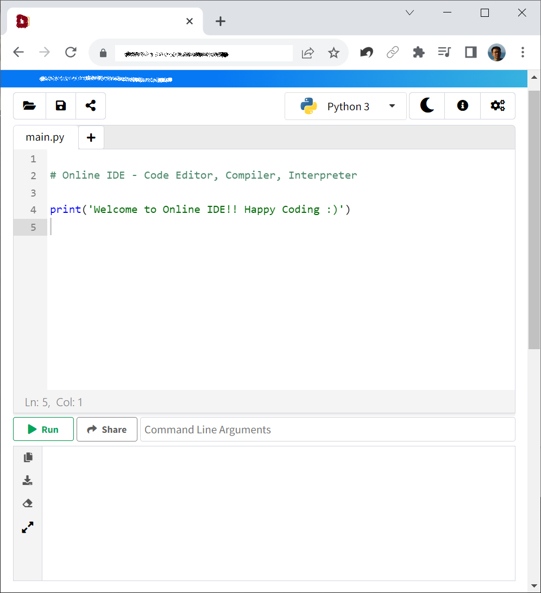
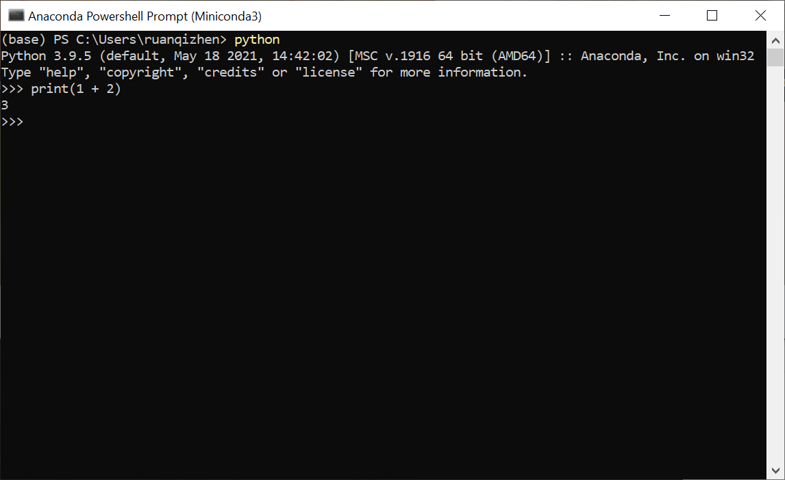
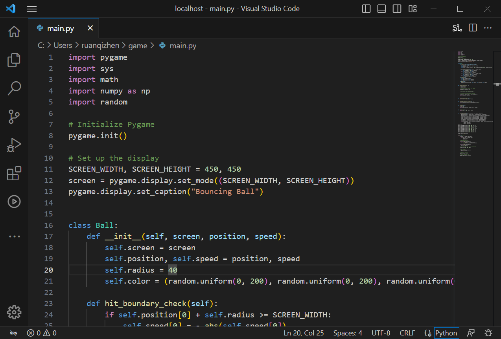
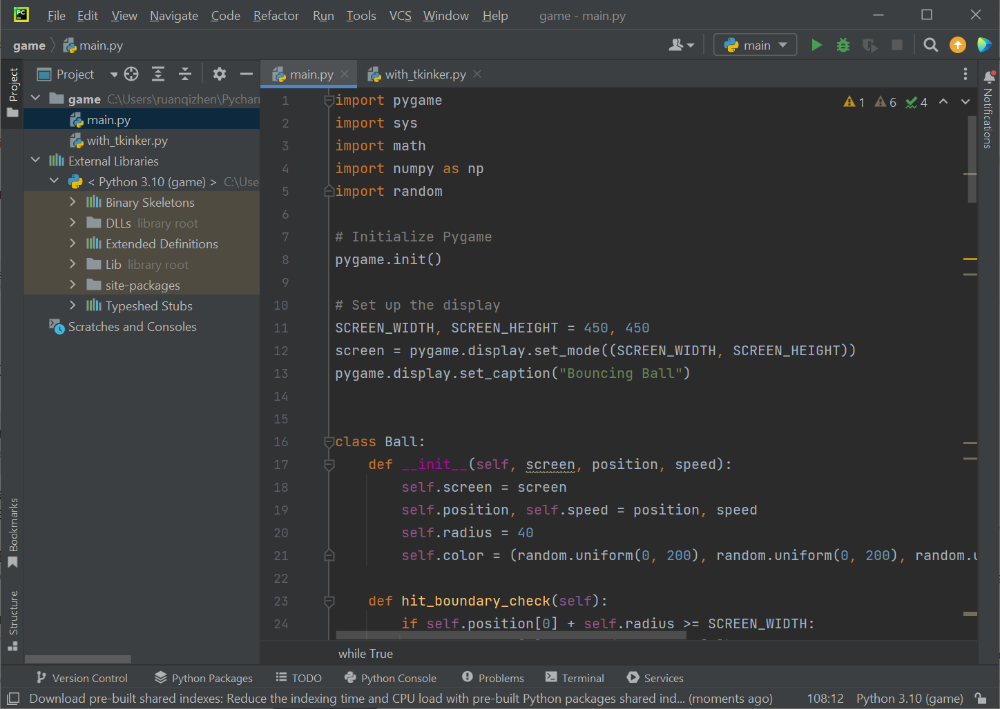
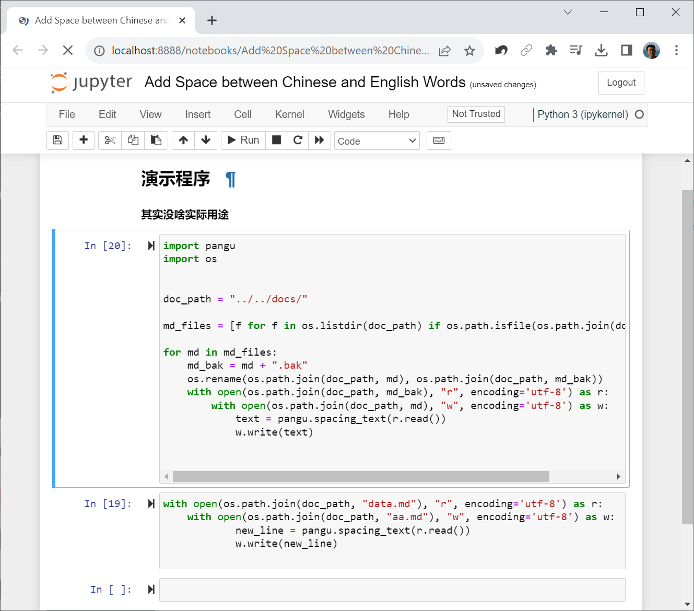

# Python Programming Basics

In this section, we will introduce the core syntax and fundamental usage of the Python language. Programming is a highly practical skill — you can start learning from anywhere, but you must write code yourself to truly master the knowledge. So first, we need to consider: where do we write code?

There are several different options. Beginners on the planet Pythora usually start with third-party free online development environments. After gaining some understanding of Python, when they need to continue with more in-depth learning, they install more professional development environments on their own computers.

## Third-Party Online Development Environments

In the past, writing, running, and testing code typically required installing specific programming environments and tools on a local machine. But with the advancement of technology, we can now use online Integrated Development Environments (IDEs) directly in a browser to write, run, and test code. This way, we no longer need to install any software or tools on our own computers — just open a web page and start writing and running programs. As a popular programming language, Python has many online IDEs designed specifically for it. Below, we'll introduce how to use online IDEs to write Python programs.

If readers don't already have a go-to online IDE, they can search for "online IDE" on Google to find plenty of free online programming websites — feel free to pick any one. At the time of writing this book, the top two IDEs appearing in search results were:

* [https://www.online-ide.com/online_python_ide](https://www.online-ide.com/online_python_ide)
* [https://ideone.com/](https://ideone.com/)

* Other commonly used online IDEs include Replit, Programiz, etc.

The page of a typical online programming environment looks like this:



The main area of the page is a text box where you write your program. After writing code, you can run it to see the results. Online IDEs usually have a "Run" or "Execute" button — clicking it causes the IDE to execute your code on its server and display the output on the screen. The lower half of the editing environment shown above is the information output area, used to observe the program's running status, results, and other information.

More advanced online development environments offer login options. If a user creates an account, they can store their programs on the website long-term, and even share program links directly with others. Unregistered users should note that programs may be lost after closing the webpage — if you need to keep a record, you must download the program to your local computer. Currently, the most famous Python online IDE is [Google Colab](https://colab.research.google.com/), where many open-source projects are developed and shared.

The websites introduced above all run the Python programs you write on their servers and display the results on the web page. There is also a lighter category of development environments that run Python programs directly in the user's browser. For example, this is a page built with pyodide: [https://qizhen.xyz/pyodide](https://qizhen.xyz/pyodide); this is a page built with brython: [https://qizhen.xyz/brython](https://qizhen.xyz/brython). Both of these pages are used to run Python programs in the browser, handy for quick tests while learning. The principle behind such pages is to first translate the Python program into JavaScript code — since browsers can directly run JavaScript programs, this indirectly runs the user's Python program.

JavaScript-based Python interpreters can be embedded into any web page more easily and are convenient to use. However, they generally only support the most basic Python features, and many advanced features are unavailable. Moreover, their program execution behavior may differ from the most commonly used Python interpreter written in C. Therefore, it is still recommended that readers prioritize online development environments that run programs on a server for their learning.

## Installing the Python Interpreter

If online development environments no longer meet your needs, you'll need to install Python on your own computer.

Here's an important choice: install the official standard version or the Conda distribution?

- **Official Standard Version**: Download from the [Python official website](https://www.python.org/downloads/). It is very lightweight and suitable for learning basic syntax.
- **Conda Distribution (Recommended)**: If you plan to do data analysis, machine learning development in the future, or need to run multiple different Python versions on your computer simultaneously, Conda is the better choice. It comes with its own Python interpreter, so once Conda is installed, you usually don't need to separately install the official standard Python.

Residents of Pythora often face complex project requirements. For instance, an old project must run on Python 3.9, while a new project requires Python 3.12; or one project depends on PyTorch 1.x, while another needs PyTorch 2.x. If you only install one Python, resolving these conflicts can be incredibly hair-pulling. Therefore, Pythora residents generally use Conda to create independent "parallel universes" (virtual environments) for each project.

### Managing Environments with Conda

In the open-source community, the most popular Conda distributions are [Miniconda](https://docs.conda.io/en/latest/miniconda.html) (a lightweight version containing only the core) and [Anaconda](https://www.anaconda.com/) (a full-featured version containing almost all scientific computing libraries, with a larger size). Beginners are recommended to install Anaconda to save the trouble of installing various libraries later.

After installing Conda, open a terminal (Anaconda Prompt on Windows), and you'll notice a `(base)` prefix before the prompt, indicating that you are currently in the default base environment.

Suppose we want to write a game. To avoid conflicts with other programs, we create an independent new environment for it, named `game`, and specify Python version 3.9:

```sh
(base) qizhen@deep:~$ conda create --name game python=3.9

```

Use the `conda env list` command to list all created environments and their folder paths. We need to remember this path — it is often used when configuring interpreters in VS Code or PyCharm.

```sh
(base) qizhen@deep:~$ conda env list
# conda environments:
#
base                  * /home/qizhen/anaconda3
game                     /home/qizhen/anaconda3/envs/game

```

To enter this new environment, run the `activate` command:

```sh
(base) qizhen@deep:~$ conda activate game
(game) qizhen@deep:~$ 
```

As you can see, the command prompt changed from `(base)` to `(game)`. Now, any libraries you install in this environment will not affect the external `base` environment, and vice versa.

## Professional Local IDEs

The Python interpreter only provides the simplest command-line interface. Running the "python" command in a command-line environment starts the Python environment, where you can enter code to run:



This is clearly not a particularly comfortable programming environment. A better approach is to write code in your favorite text editor (for instance, on Pythora, the most popular text editing tool is Notepad++), and after writing all the code, call the python command to run the entire program. There are also various tools specifically designed for code editing on the market, which are more suitable for writing programs than ordinary text editors. Currently, the most popular free Python IDEs are Visual Studio Code (VS Code) and PyCharm. If you use multiple programming languages, VS Code is an excellent choice; if Python is the only programming language you use, then PyCharm is more suitable.

### Visual Studio Code (VS Code)

VS Code is a lightweight, highly configurable code editor that supports various languages and tools. You can download and install VS Code from the [Visual Studio Code official website](https://code.visualstudio.com/). VS Code can be used to write and run programs in multiple programming languages. For Python, you can click the Extensions icon on the left toolbar in VS Code (or press Ctrl+Shift+X), then search for "Python". Select and install the Python extension provided by Microsoft to get Python-specific features such as syntax highlighting, IntelliSense, code formatting, debugging, linting, and more.

The image below shows a Python program opened in VS Code:



Open or create a Python file. In the top-right corner or bottom status bar of the file, you can select the Python interpreter version. Click it, then choose the Python interpreter that matches your project.

Now, you can start writing Python code in VS Code. Since the Python extension is installed, you'll get support for features like auto-completion and parameter hints while writing code.

At the top of the Python file editor, you should see a green Run button. Click it to execute the current Python file. You can also right-click in the editor and select "Run in Python Terminal" to execute the code.

VS Code also provides debugging, version control, virtual environment management, and almost all other features commonly used in software development. Additionally, the VS Code community offers many useful extensions to help programmers work with Python projects — for example, the Python Test Explorer plugin helps run and debug Python unit tests, among other things.

### PyCharm

PyCharm is a professional Python IDE provided by JetBrains, hailed by many developers as a game-changer for Python development. It integrates numerous powerful features, including code completion, smart hints, debugging, testing support, version control, etc., making Python development efficient and convenient.

Download PyCharm from the [PyCharm official website](https://www.jetbrains.com/pycharm/). PyCharm comes in two editions: Professional (paid) and Community (free). For personal use, the free Community edition is sufficient.

PyCharm's usage is very similar to VS Code, with only slight differences in the interface. In PyCharm, you can create multiple Python projects and select the appropriate interpreter and virtual environment for each project. In addition to basic features like running, debugging, and code management, PyCharm also offers a wide range of extension plugins. Whether you are a beginner or an experienced developer, PyCharm can greatly improve the efficiency and quality of Python development.

The image below shows the same program opened in PyCharm:



## Web-Based Programming Environments

Traditional IDEs are often standalone applications, but in recent years, programming environments that lack a standalone user interface and rely on web browsers for their interface have become popular. Jupyter Notebook and its upgraded version JupyterLab are typical examples of this. Google Colab, introduced earlier, is also a derivative of Jupyter Notebook.

Jupyter Notebook is an open-source interactive programming environment. It is not an application itself, but a web service. When you start this service, you open a related web page in a web browser to edit and run programs. Compared to traditional IDEs, it has several notable advantages:

* **Interactive Programming**: It divides program code into many cells, each of which can be run independently, allowing you to see output results immediately — extremely useful for data analysis and visualization.
* **Rich Text Support**: You can use Markdown and LaTeX to format text and equations, produce text with different fonts and styles, and embed images, videos, and more. This truly integrates programs with documentation.
* **Easy to Share**: Its rich text content can be exported to various document formats such as PDF, HTML, etc., making it easy to share reports and analysis results. Moreover, since it is itself a web service, it can easily allow others to access local program content.
* **Multi-Language Support**: Although traditional IDEs also support multiple programming languages, Jupyter Notebook and its derivatives go a step further by integrating code from different programming languages within the same file. You can run one segment of a program in one language and another segment in a different language.

Jupyter Notebook also possesses the advantages of other traditional IDEs, such as plugin extensions and cross-platform support.

Jupyter Notebook is especially popular among data scientists, researchers, and academics. The image below shows a program opened in Jupyter Notebook:



### Installation and Usage:

If you installed Anaconda, Jupyter is already built in and requires no separate installation. If you are using the official Python, you need to install it via the command line:

```sh
pip install jupyterlab
```

Enter the following command in a command line or terminal to start a web service needed for programming:

```sh
jupyter lab
```

It will automatically open the programming interface in your browser. If the page does not open automatically, or if it was accidentally closed, you can also open your browser yourself and enter the URL: `http://localhost:8888/` to reopen the programming page.

On the main page that opens, click the "New" button, select your target programming language (e.g., Python 3), and you can create a new Notebook file. We refer to each program as a "Notebook". In the new Notebook, you can enter Python code and click the "Run" button (or press Shift + Enter) to execute it. Click the "+" button at the top of the page to add a new cell. You can select "Markdown" mode in a cell and then enter Markdown text or LaTeX equations. Click the save button at the top of the page (or press Ctrl + S) to save the current program. If you need to exit the programming environment, you can close the browser tab, return to the command line, and press Ctrl + C to terminate the Jupyter Notebook service.

The file extension for files saved by Jupyter Notebook is not .py but .ipynb. This is because the file needs to store not only the program code, but also the program's execution results, rich text documents, and other content. However, in the Jupyter Notebook menu options, you can export and save a .py file containing only the code.

---

Residents of Pythora use all of the development environments mentioned above. Generally, Pythora residents use third-party online editors when learning or testing small programs (such as interview questions); they use PyCharm when developing personal applications or web pages; at work, when doing data analysis, machine learning, or similar types of projects, they use a company-setup environment similar to Jupyter Notebook for development; and when developing work-related applications, web applications, and similar programs, they use VS Code.
