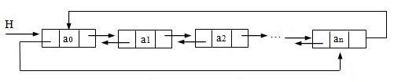

# Linked List

## Basic Concepts

A linked list is a fundamental data structure for storing collections of elements. Unlike arrays, elements in a linked list are not stored in contiguous memory locations; instead, each element is linked to the next via a pointer.

Each element in a linked list is called a **node**. A node typically consists of two fields: the **data** field (which stores the element's value) and the **pointer** field (which stores a reference/pointer to the next node in the sequence). The first node of a linked list is called the **head**. We reference the entire list via this head node. The last node is the **tail**, and its pointer points to `None`, signaling the end of the list.


## Basic Operations

The most basic operations of a linked list include:

* Creating an empty linked list
* **Inserting a new node**: Since linked lists do not support index-based access, insertions are typically performed relative to a reference node (e.g., inserting before or after a given node) or at the boundaries (inserting at the head or tail of the list).
* **Deleting a node**: Remove a node by updating the pointers of its neighbors.
* **Traversing and searching**: Iterate through the nodes sequentially to find a specific value or display the list.

The following program implements these basic operations:

```python
class Node:
    def __init__(self, data):
        self.data = data
        self.next = None

class LinkedList:
    def __init__(self):
        self.head = None

    def append(self, data):       # Add a new node to the end of the linked list
        new_node = Node(data)     # Create a new node
        if not self.head:         # Empty linked list
            self.head = new_node
            return
        last_node = self.head
        while last_node.next:     # Find the tail of the linked list
            last_node = last_node.next
        last_node.next = new_node # Link to the new node

    def print_list(self):
        cur_node = self.head
        while cur_node:           # Traverse each node
            print(cur_node.data, end=" -> ")
            cur_node = cur_node.next
        print("None")

    def insert_after_node(self, prev_node, data):
        if not prev_node:
            print("Previous node is not in the list")
            return
        new_node = Node(data)
        new_node.next = prev_node.next # The new node's pointer points to the reference node's next node
        prev_node.next = new_node      # The reference node's pointer points to the new node

    def find_node_by_key(self, key):
        cur_node = self.head
        while cur_node:                # Traverse all nodes, comparing one by one
            if cur_node.data == key:   # Until the target node is found
                return cur_node
            cur_node = cur_node.next
        return None

    def delete_node(self, node_to_delete):
        if not node_to_delete:
            return

        # If the node to be deleted is the head node
        if self.head == node_to_delete:
            self.head = self.head.next
            return

        prev_node = None
        cur_node = self.head    
        while cur_node and cur_node != node_to_delete:
            prev_node = cur_node        # Find the previous node
            cur_node = cur_node.next
        
        # If the node is not in the list, return directly
        if not cur_node:
            return
        
        # Remove the current node from the linked list
        prev_node.next = cur_node.next

# Using the linked list
llist = LinkedList()
llist.append(1)
llist.append(2)
llist.append(3)
llist.print_list()  # Output: 1 -> 2 -> 3 -> None

node_to_delete = llist.find_node_by_key(2)
llist.delete_node(node_to_delete)
llist.print_list()  # 1 -> 3 -> None
```

In the code above, the `Node` class represents an individual element in the linked list. Each node has two attributes: `data` (which stores the value) and `next` (a reference to the next node).

The `LinkedList` class represents the list itself. It features a `head` attribute that points to the first node. The `append()` method appends a node to the end, `insert_after_node()` inserts a node directly after a reference node, `find_node_by_key()` searches for a node by value, and `delete_node()` removes a node.

As shown in the implementation above, inserting a node at the head of a linked list (or inserting when the predecessor node is already known) has a time complexity of $O(1)$. However, the `append()` method must traverse the entire list to locate the tail before linking the new node, resulting in a time complexity of $O(n)$.

In a singly linked list, deleting a specific node has a time complexity of $O(n)$ because we must traverse the list to find the node's predecessor. If we only needed to delete the *next* node after a given node, we could bypass traversal and perform the deletion in $O(1)$ time. In a doubly linked list, node deletion is always an $O(1)$ operation because every node maintains a direct reference to its predecessor.


## Doubly Linked List 



In a doubly linked list, each node stores references to both the previous and next nodes. This allows for bidirectional traversal. If the `next` pointer of the tail node points to the head node, and the `prev` pointer of the head node points to the tail node, it forms a **circular doubly linked list**, as illustrated above.

Singly linked lists can also contain cycles. In a cyclic linked list, some nodes may lie outside the loop while the rest form a closed cycle. In practice, non-circular linked lists are far more common.

```python
class Node:
    def __init__(self, data):
        self.data = data
        self.next = None
        self.prev = None

class DoublyLinkedList:
    def __init__(self):
        self.head = None

    # Insert a node at the end of the linked list
    def append(self, data):
        new_node = Node(data)
        if not self.head:
            self.head = new_node
            return
        last_node = self.head
        while last_node.next:
            last_node = last_node.next
        last_node.next = new_node
        new_node.prev = last_node

    # Insert a node at the head of the linked list
    def prepend(self, data):
        new_node = Node(data)
        new_node.next = self.head
        if self.head:
            self.head.prev = new_node
        self.head = new_node

    # Delete a node
    def delete(self, node):
        cur_node = self.head
        while cur_node:
            if cur_node == node:
                # Delete the head node
                if cur_node.prev:
                    cur_node.prev.next = cur_node.next
                else:
                    self.head = cur_node.next
                # Delete the tail node
                if cur_node.next:
                    cur_node.next.prev = cur_node.prev
                return  # Node deleted, exit loop
            cur_node = cur_node.next

    # Print the linked list
    def print_list(self):
        cur_node = self.head
        while cur_node:
            print(cur_node.data, end=" <-> ")
            cur_node = cur_node.next
        print("None")

# Using the doubly linked list
dllist = DoublyLinkedList()
dllist.append(1)
dllist.append(2)
dllist.append(3)
dllist.print_list()  # 1 <-> 2 <-> 3 <-> None

node_to_delete = dllist.head.next  # Select the second node (value 2) for deletion
dllist.delete(node_to_delete)
dllist.print_list()  # 1 <-> 3 <-> None
```

The implementation of a doubly linked list is similar to that of a singly linked list, except that each node contains two pointers to reference both its predecessor and successor.

## Common Problems

### Reverse Linked List

To reverse a singly linked list, we traverse the list and redirect each node's pointer to point to its predecessor instead of its successor. We must temporarily store references to adjacent nodes to avoid losing the rest of the list during traversal. This can be accomplished either iteratively or recursively.

```python
class Node:
    def __init__(self, data):
        self.data = data
        self.next = None

class LinkedList:
    def __init__(self):
        self.head = None

    def append(self, data):
        new_node = Node(data)
        if not self.head:
            self.head = new_node
            return
        last_node = self.head
        while last_node.next:
            last_node = last_node.next
        last_node.next = new_node

    def print_list(self):
        cur_node = self.head
        while cur_node:
            print(cur_node.data, end=" -> ")
            cur_node = cur_node.next
        print("None")

    def reverse(self):
        prev = None
        current = self.head
        while current:
            next_node = current.next  # store the next node
            current.next = prev  # change the current node's pointer to previous
            prev = current  # move the previous to this current
            current = next_node  # move to the next node
        self.head = prev
        
    def reverse_recursive(self):
        self.head = self._reverse_recursive(self.head)

    def _reverse_recursive(self, node):
        if node is None or node.next is None:
            return node
        
        next_node = node.next
        new_head = self._reverse_recursive(next_node)
        
        next_node.next = node
        node.next = None
        
        return new_head

# Test
llist = LinkedList()
llist.append(1)
llist.append(2)
llist.append(3)
llist.append(4)
llist.print_list()  # 1 -> 2 -> 3 -> 4 -> None

llist.reverse()
llist.print_list()  # 4 -> 3 -> 2 -> 1 -> None

llist.reverse_recursive()
llist.print_list()  # 1 -> 2 -> 3 -> 4 -> None
```

Both iterative and recursive approaches run in $O(n)$ time, where $n$ is the number of nodes, because they process each node once. Since the reversal is performed in-place by updating existing pointers, the space complexity is $O(1)$.


### Detecting a Cycle


To detect if a linked list contains a cycle, we check if any node is visited more than once during traversal.

The most straightforward approach is to mark visited nodes. If node structures can be modified, we can add a boolean flag (e.g., `visited = True`) to each node as we pass it. If we encounter a node that is already flagged, a cycle exists. If modifying the nodes is not possible, we can use a set to store visited node references. During traversal, we check if the current node is already in the set; if it is, we have detected a cycle.

Both of the above methods require $O(n)$ auxiliary space to track visited nodes. To optimize this, we can use Floyd's Cycle-Finding Algorithm (often called the "fast and slow pointer" algorithm), which reduces the space complexity to $O(1)$.

The core idea is to traverse the list with two pointers: a slow pointer that moves one step at a time, and a fast pointer that moves two steps at a time. If the list contains a cycle, the fast pointer will eventually wrap around and meet the slow pointer. The implementation is as follows:

```python
class Node:
    def __init__(self, data):
        self.data = data
        self.next = None

class LinkedList:
    def __init__(self):
        self.head = None

    def append(self, data):
        new_node = Node(data)
        if not self.head:
            self.head = new_node
            return
        last_node = self.head
        while last_node.next:
            last_node = last_node.next
        last_node.next = new_node

    def create_cycle(self, pos):
        # This method is used to create a cycle for testing purposes
        tail = self.head
        while tail.next:
            tail = tail.next
        
        cycle_start = self.head
        for i in range(pos):
            cycle_start = cycle_start.next
        tail.next = cycle_start

    def has_cycle(self):
        slow_pointer = self.head
        fast_pointer = self.head

        while fast_pointer and fast_pointer.next:
            slow_pointer = slow_pointer.next
            fast_pointer = fast_pointer.next.next

            if slow_pointer == fast_pointer:
                return True

        return False

# Using the singly linked list
llist = LinkedList()
llist.append(1)
llist.append(2)
llist.append(3)
llist.append(4)

print(llist.has_cycle())  # False

# Create a cycle for testing
llist.create_cycle(1)
print(llist.has_cycle())  # True
```


### Remove the Nth Node from the End

To remove the $n$-th node from the end of a singly linked list, we must traverse from front to back since the pointers only flow in one direction.

An intuitive approach is to buffer the last $n$ visited nodes during traversal, but this requires $O(n)$ auxiliary memory. A more elegant, $O(1)$ space solution uses two pointers ("fast" and "slow") separated by a gap of $n$ nodes. By advancing the fast pointer $n$ steps ahead first, and then moving both pointers at the same speed, the slow pointer will point to the predecessor of the target node when the fast pointer reaches the end of the list:

```python
class Node:
    def __init__(self, data):
        self.data = data
        self.next = None

class LinkedList:
    def __init__(self):
        self.head = None

    def append(self, data):
        new_node = Node(data)
        if not self.head:
            self.head = new_node
            return
        last_node = self.head
        while last_node.next:
            last_node = last_node.next
        last_node.next = new_node

    def print_list(self):
        cur_node = self.head
        while cur_node:
            print(cur_node.data, end=" -> ")
            cur_node = cur_node.next
        print("None")

    def remove_nth_from_end(self, n):
        first = self.head
        second = self.head

        # Advance the second pointer by n nodes.
        for _ in range(n):
            if not second.next:  # If n is equal to the length of the linked list
                if second == self.head:  # Move head to the next node
                    self.head = self.head.next
                return
            second = second.next

        # Move both pointers until the second reaches the end
        while second:
            second = second.next
            prev = first
            first = first.next

        # Now, the first pointer points to the node to be removed
        prev.next = first.next

# Using the LinkedList
llist = LinkedList()
llist.append(1)
llist.append(2)
llist.append(3)
llist.append(4)
llist.append(5)

print("Original List:")
llist.print_list()

llist.remove_nth_from_end(2)
print("\nAfter removing the 2nd node from the end:")
llist.print_list()
```

This problem has a robust "fast and slow pointer" implementation. We advance the fast pointer $n$ steps. If the fast pointer becomes `None`, it means the node to remove is the head node itself. Otherwise, we advance both pointers until the fast pointer reaches the last node, at which point the slow pointer will be positioned just before the node to be deleted:

```python
    def remove_nth_from_end(self, n):
        fast = self.head
        slow = self.head

        # Let the fast pointer move n steps first
        for _ in range(n):
            if fast is None:
                print("n is greater than the length of the linked list")
                return
            fast = fast.next
        
        # If the fast pointer reaches None, it means the nth node from the end is the head node
        if fast is None:
            self.head = self.head.next
            return

        # Move the fast and slow pointers synchronously until the fast pointer reaches the last node
        while fast.next:
            fast = fast.next
            slow = slow.next
        
        # At this point, slow points to the (n+1)th node from the end, delete its next node
        slow.next = slow.next.next
```

### Intersection of Two Linked Lists

To find the intersection node of two singly linked lists, we can first compute the lengths of both lists. By calculating the difference in lengths, we can advance the pointer of the longer list by this difference. Afterward, we traverse both lists synchronously; the point at which the two pointers meet is the intersection node.

```python
class ListNode:
    def __init__(self, x):
        self.val = x
        self.next = None

def get_intersection_node(headA, headB):
    def get_count(node):
        count = 0
        while node:
            count += 1
            node = node.next
        return count
    
    countA = get_count(headA)
    countB = get_count(headB)
    diff = abs(countA - countB)
    
    # Move the pointer for the longer list by the difference in counts
    long_list = headA if countA > countB else headB
    short_list = headB if countA > countB else headA
    for _ in range(diff):
        long_list = long_list.next
    
    # Move both pointers of both lists till they collide
    while long_list and short_list:
        if long_list == short_list:
            return long_list  # Intersection point
        long_list = long_list.next
        short_list = short_list.next
    
    return None  # No intersection

# Test:
intersect_val = 8
# Define the common part
common_node = ListNode(8)
common_node.next = ListNode(4)
common_node.next.next = ListNode(5)

# Build linked list A: 4 -> 1 -> (8 -> 4 -> 5)
headA = ListNode(4)
headA.next = ListNode(1)
headA.next.next = common_node

# Build linked list B: 5 -> 0 -> 1 -> (8 -> 4 -> 5)
headB = ListNode(5)
headB.next = ListNode(0)
headB.next.next = ListNode(1)
headB.next.next.next = common_node

# Find the intersection point
result = get_intersection_node(headA, headB)
if result:
    print(f"The intersection point's value is: {result.val}")
else:
    print("No intersection found.")
```

If the two linked lists are completely disjoint, the function returns `None`.
