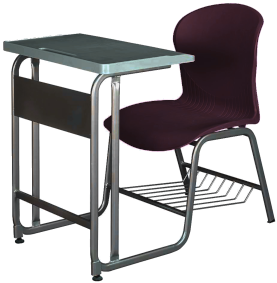

# Multiple Inheritance

## Basic Method

Python allows multiple inheritance for classes. You just need to specify multiple parent classes in order when defining a subclass, for example:

```python
class A(B, C):
    pass
```

The code above indicates that class A inherits all attributes and methods from both classes B and C. Let's look at a more complex example:

Suppose there is a furniture store that only sells two types of furniture: tables and chairs. We will write a program to simulate the attributes and methods of these furniture items in the store. We could design the program roughly like this:

First, write a "Furniture class" that contains all the attributes and methods common to all furniture, such as the furniture's ID, cost price, tax rate, main material, assembly method, and so on. Next, we can design separate "Table class" and "Chair class". These two classes can inherit from the "Furniture class", so they automatically have all the attributes and methods of the "Furniture class". After that, we may also need to write some attributes and methods specific to them. For example, the "Table class" could have a "lay tablecloth" method, while the "Chair class" could have a "place pillow" method. The relationships between the classes in this program are basically set up. Depending on the need, we might also create more specific classes, such as deriving "DiningTable class" or "Desk class" from the "Table class". Every physical piece of furniture in the store can be an object of one of these classes.

At this point, we suddenly discover that there is also a type of furniture in the store that is both a table and a chair, as shown in the illustration:



We can call it a table-chair combo. This combo has both the attributes and methods of a table and those of a chair. The most intuitive approach is that it should simultaneously have two parent classes: the "Table" class and the "Chair" class. It should inherit all the attributes and methods from both parent classes:

```python
# Base class
class Furniture:
    def __init__(self, material, furniture_id, cost):
        self.material = material
        self.id = furniture_id
        self.cost = cost

    def description(self):
        return f"Furniture ID: {self.id}, Main material: {self.material}, Cost: ${self.cost}."

    def assemble(self):
        print(f"Furniture {self.id} has been assembled.")

# Subclass
class Chair(Furniture):
    def __init__(self, material, furniture_id, cost):
        super().__init__(material, furniture_id, cost)

    def set_number_of_legs(self, number_of_legs):
        self.number_of_legs = number_of_legs
        
    def description(self):
        return super().description() + f"It has {self.number_of_legs} legs."

    def add_pillow(self):
        print(f"A pillow has been installed on chair {self.id}.")

# Another subclass
class Table(Furniture):
    def __init__(self, material, furniture_id, cost):
        super().__init__(material, furniture_id, cost)

    def set_shape(self, shape):
        self.shape = shape
        
    def description(self):
        return super().description() + f"Table shape: {self.shape}."

    def lay_tablecloth(self):
        print(f"A tablecloth has been laid on table {self.id}.")

# Multiple inheritance, inheriting from both Chair and Table
class ChairWithTableAttached(Chair, Table):
    def __init__(self, material, furniture_id, cost):
        super().__init__(material, furniture_id, cost) 

    # Override the description method
    def description(self):
        # Below, we directly call the parent class methods using the class name.
        # We cannot use the super() function here because we need to use multiple
        # parent classes, and super() can only return one of them.
        chair_desc = Chair.description(self)  
        table_desc = Table.description(self)  
        return f"Chair part: {chair_desc}  Table part: {table_desc}"

# Example
item = ChairWithTableAttached("solid wood", 101, 150.00)
item.set_number_of_legs(4)
item.set_shape("round")

print(item.description())
item.assemble()
item.add_pillow()
item.lay_tablecloth()
```

Here, let the reader consider a question: In the example above, which class does the super() function in the constructor of ChairWithTableAttached return? Chair or Table? This might be hard to answer.

So which class does the super() function in the constructor of Chair return? The answer should be very clear: "Chair only has one parent class, Furniture, so super() must return Furniture." That's not necessarily true. At the end of this section, we will come back to discuss this question.

## Problems with Multiple Inheritance

If you are already familiar with class inheritance, the program above is still fairly intuitive. Multiple inheritance may not seem complicated, but if you think about it more deeply, you'll find there are many problems. The "Table-Chair Combo" class inherits from both Table and Chair. The Table and Chair classes may have some attributes and methods with the same names, so which ones does the combo class inherit? Our expectations might also vary:

* Sometimes we may need to keep methods with the same name from both parent classes. For example, both Table and Chair have a "material" attribute. The table part and the chair part of the "Table-Chair Combo" class might be made of different materials, so we need to keep the "material" attributes from both parent classes.
* Sometimes we should keep only one copy of a method with the same name from both parent classes. For example, both Table and Chair have a "cost" method. After all, the table-chair combo is one item, so it only needs one price.
* A more troublesome situation: there is a program that handles all furniture, and its input data type is "Furniture class". When a table-chair combo is passed to the program as an instance of the "Furniture" class, the program reads the "material" method of the instance. At this point, do you think the program will get the attribute inherited from the Table class, the attribute inherited from the Chair class, or the attribute they both inherited from the "Furniture" class in the first place?

Different programming languages have different rules for handling the above issues, and these rules are usually related to whether the subclass has overridden the attributes or methods. C++ is an early programming language that allows multiple inheritance, but because of these easily confusing problems, multiple inheritance creates more trouble than the problems it can solve. In fact, programming languages definitely define how to handle these situations clearly. The problem is that the rules are too complicated, and programmers can't keep track of them. Programmers end up writing code that produces all sorts of inexplicable results. A common piece of advice when learning C++ programming is to avoid using multiple inheritance whenever possible. Some mainstream programming languages that emerged after C++ learned from C++'s lessons and simply disabled multiple inheritance for classes.

In programming languages that prohibit multiple inheritance, "interfaces" are generally used to implement a class with multiple different functionalities. The core difference between a class and an interface is that class inheritance is about borrowing functionality that the parent class already has, while interface implementation is about ensuring that a class can provide certain functionality. For example, if we write a "Table-Chair Combo class" that inherits from the "Table class", it means the combo is a special kind of table, and it directly borrows the various functionalities already implemented by the Table class. In another scenario, if we write a "Table-Chair Combo class" that implements the "Table interface", it does not mean the combo is a special kind of table; it only means the combo will provide all the functionalities that a table should have.

Interfaces allow a special class to have multiple different functionalities without having to belong to both one parent class and another. This avoids the chaotic data relationships brought about by network-like inheritance. Of course, interfaces also have disadvantages, such as not being convenient for code reuse. An interface only specifies what functionality a class needs to implement; the actual implementation code still has to be written separately in each class.

## Abstract Classes

Python does not have the concept of interfaces, but it has a very similar concept: abstract classes.

First, let's introduce a concept: abstract method. An abstract method is a method that is declared in a parent class but has no specific implementation. After a subclass inherits from the parent class containing the abstract method, it must implement the method in the subclass. The parent class containing the abstract method cannot be instantiated, because it contains unimplemented methods that cannot be used by concrete objects. Such a class, which cannot be instantiated and can only be inherited by other classes, is an abstract class.

Taking the furniture store example from above, it should not allow a furniture object that is neither a chair, nor a table, nor a table-chair combo to appear. This is because, in the program, the furniture store only has these three types of furniture. If an object appears that does not belong to any of the classes defined in the program, it is most likely an inadvertent mistake by the programmer. Therefore, the "Furniture class" is very suitable as an abstract class; it should not generate any instances.

Tables and chairs represent both a certain functionality and a certain type of furniture. So when designing, we can separate abstract methods from concrete implementation methods: use the AbstractTable abstract class to define the methods a table must have, and use the Table regular class to define a type of furniture.

Python, unlike some other languages, cannot define a function without implementing it. In Python, both functions and classes are defined and implemented together. Therefore, to make a function abstract, you use a decorator (@abstractmethod). An abstract class is implemented by inheriting from the built-in class ABC (short for Abstract Base Class).

For example, the furniture store program rewritten using abstract classes is as follows:

```python
from abc import ABC, abstractmethod

# Abstract class Furniture, defines the attributes and methods that all furniture must have
class Furniture(ABC):
    
    @abstractmethod
    def set_material(self, material):
        pass
    
    @abstractmethod
    def assemble(self):
        pass

# Abstract class AbstractTable, defines the attributes and methods a table must have
class AbstractTable(Furniture):
    
    @abstractmethod
    def place_tablecloth(self):
        pass

# Abstract class AbstractChair, defines the attributes and methods a chair must have
class AbstractChair(Furniture):
    
    @abstractmethod
    def place_pillow(self):
        pass
    
# Concrete class Table, implements the attributes and methods defined by AbstractTable
class Table(AbstractTable):
    
    def set_material(self, material):
        self.material = material
        print(f"Setting table material: {self.material}.")

    def assemble(self):
        print("The table has been assembled!")

    def place_tablecloth(self):
        print("A tablecloth has been laid on the table.")

# Concrete class Chair, implements the attributes and methods defined by AbstractChair
class Chair(AbstractChair):

    def set_material(self, material):
        self.material = material
        print(f"Setting chair material: {self.material}.")

    def assemble(self):
        print("The chair has been assembled!")

    def place_pillow(self):
        print("A pillow has been placed on the chair.")
    
# Concrete class ChairWithTableAttached, implements all the attributes and methods of a table or chair
class ChairWithTableAttached(AbstractTable, AbstractChair):

    def set_material(self, material):
        self.material = material
        print(f"Setting combo furniture material: {self.material}.")

    def assemble(self):
        print("The table-chair combo has been assembled!")

    def place_tablecloth(self):
        print("A tablecloth has been laid on the table-chair combo.")

    def place_pillow(self):
        print("A pillow has been placed on the table-chair combo.")

# Usage examples
table = Table()
table.set_material("glass")
table.assemble()
table.place_tablecloth()

chair = Chair()
chair.set_material("wood")
chair.assemble()
chair.place_pillow()

combo = ChairWithTableAttached()
combo.set_material("plastic")
combo.assemble()
combo.place_tablecloth()
combo.place_pillow()
```

## MixIn

Abstract classes are very similar to interfaces, and they share the same pros and cons. Abstract classes also do not solve the problem of code reuse. For example, in the above example, the set_material method must be implemented in every class, even though the implementation is the same each time.

In fact, although Python allows multiple inheritance for classes, it can quite effectively avoid the problem of unclear data definitions caused by chaotic inheritance relationships. The fundamental reason is still the "duck typing" strategy adopted by Python, which was mentioned earlier. In Python programs, the focus is on the behavior of objects, not the type of objects. For the example above, whether the "Table-Chair Combo class" inherits from the "Table class" is not important; it does not affect its use in the program at all. What really matters is whether the "Table-Chair Combo class" implements the functionality required for a table. This is already somewhat close to the meaning of "interfaces" in other languages.

Therefore, when designing class inheritance relationships in Python, the focus should not be on hierarchical relationships like whether a table is a special kind of furniture, or whether a table-chair combo is a special kind of table. What really matters is how to use inheritance to obtain the functionality a class needs. Based on this, the Mixin design approach is more widely used in Python.

Simply put, a MixIn is a small, reusable class that provides a set of additional methods to other classes. Each MixIn performs a specific task. However, a MixIn itself is not a complete class; MixIns are usually not designed to work independently — they are designed to be used together with other classes. MixIns typically do not have their own objects, so they do not need constructors.

We can use MixIns to redesign the furniture store program. First, we can abstract some features or functionalities and make them into MixIns. For example:

* MaterialMixin: Used to set the material of furniture.
* AssemblyMixin: Defines assembly methods for furniture.
* PillowPlacementMixin: Defines the method for placing a pillow on a chair.
* TableclothMixin: Defines the method for laying a tablecloth on a table.

Then, the program can use these MixIns to construct the original classes:

```python
# Define MixIns
class MaterialMixin:
    material = "unknown material"
    
    def set_material(self, material):
        self.material = material
        print(f"Material set to: {self.material}")


class AssemblyMixin:
    def assemble(self):
        print("Furniture has been assembled!")


class PillowPlacementMixin:
    def place_pillow(self):
        print("A pillow has been placed on the chair.")


class TableclothMixin:
    def place_tablecloth(self):
        print("A tablecloth has been laid on the table.")


# Use MixIns to refactor the original classes
class Furniture(MaterialMixin, AssemblyMixin):
    def __init__(self, id, cost, **kwargs):
        # Pass **kwargs to the next class, ensuring other classes in the MRO chain (including object) work correctly
        super().__init__(**kwargs) 
        self.id = id
        self.cost = cost


class Chair(PillowPlacementMixin, Furniture):
    def __init__(self, id, cost, number_of_legs=4):
        # Note: This requires cooperative inheritance (mentioned below) to work perfectly
        super().__init__(id, cost)
        self.number_of_legs = number_of_legs


class Table(TableclothMixin, Furniture):
    def __init__(self, id, cost, shape="round"):
        super().__init__(id, cost)
        self.shape = shape


class ChairWithTableAttached(Furniture, PillowPlacementMixin, TableclothMixin):
    def __init__(self, id, cost, number_of_legs=4, shape="round"):
        super().__init__(id, cost)
        self.number_of_legs = number_of_legs
        self.shape = shape


# Usage examples
combo = ChairWithTableAttached("101", 150.00, 4, "round")
combo.set_material("solid wood")
combo.assemble()
combo.place_pillow()
combo.place_tablecloth()
```

In Python community best practices, Mixin classes should usually be placed at the front of the inheritance list. Reason: The role of a Mixin is typically to "enhance" or "override" the behavior of the base class. If a Mixin defines a method with the same name as one in the base class (e.g., save() or update()), placing it after the base class would cause it to be ranked after Furniture in the MRO order, leading to the Mixin's method never being called (shadowed by Furniture). Although there is no such name conflict in this example, as a tutorial, the standard idiom should be taught.

### MRO Lookup Order

In Python, if an attribute or method with the same name is implemented in both a parent class and a subclass, the subclass is always searched first, then the parent class. If there are multiple parent classes, the search follows the order they are written in the inheritance definition. Specifically, in the example above, the search order is: ChairWithTableAttached -> Furniture -> MaterialMixin -> AssemblyMixin -> PillowPlacementMixin -> TableclothMixin -> object.

This order is called the MRO (Method Resolution Order). If an attribute or method with the same name is implemented in both a parent class and a subclass, Python searches according to the MRO (Method Resolution Order) list.

Python 3 uses the C3 linearization algorithm. Its core rules are not only "subclass before parent class" but also "preserve the definition order of parent classes" and "monotonicity" (i.e., if class A comes before class B, then in the MRO of all subclasses, A comes before B).

Simply put, you can understand it as trying "left to right, depth first," but if it encounters diamond inheritance (i.e., multiple subclasses inherit from the same parent class), it intelligently puts that common parent class at the very end to avoid logical errors.

We can view the exact order by using `print(ClassName.mro())`:

```python
print(ChairWithTableAttached.mro())
```

Earlier, we asked a question: which class does the super() function in the constructors of ChairWithTableAttached, Chair, and other classes return? Let's simplify a few classes and run the program below to see which class each constructor's super() returns:

```python
class Base:
    def method(self, child):
        print(f"{child}'s super is Base")

class ChildA(Base):
    def method(self, child):
        super().method("ChildA")
        print(f"{child}'s super is ChildA")

class ChildB(Base):
    def method(self, child):
        super().method("ChildB")
        print(f"{child}'s super is ChildB")

class GrandChild(ChildA, ChildB):
    def method(self, child):
        super().method("GrandChild")
        print(f"GrandChild is called")

gc = GrandChild()
gc.method(None)  # Calls methods according to MRO
```

Running the program above produces the following result:

```
ChildB's super is Base
ChildA's super is ChildB
GrandChild's super is ChildA
GrandChild is called
```

We can see that "ChildA's super is ChildB". The super() function does not directly return the parent class; it returns a proxy object that delegates method calls to the next class in the MRO order after the current class.
