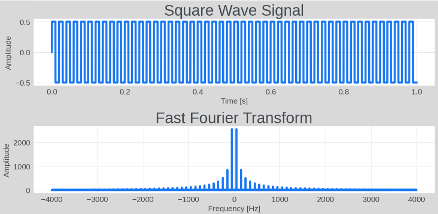

# Matrix Computing and NumPy

NumPy (short for Numerical Python) is an open-source Python library widely used in scientific computing, particularly in array computing, linear algebra, Fourier transforms, and random number generation. It provides a powerful N-dimensional array object and a large set of functions and tools for manipulating these arrays. Many advanced scientific computing packages, such as Pandas, Matplotlib, and others, are built on top of NumPy.

## Installation

NumPy is a third-party package. If you haven't installed NumPy yet, you can install it with the following command:

```sh
pip install numpy
```

To use NumPy, you first need to import it:

```python
import numpy as np
```

In the example code below, some import statements are omitted. You will need to add them yourself when testing.

## Arrays

One of NumPy's core features is its N-dimensional array (ndarray) object. It is a fast, flexible container for large datasets. Compared to Python's native lists, NumPy arrays are more efficient and support more advanced mathematical operations. Below are some commonly used array operations.

### Creating Arrays

Use the `np.array` function to convert other data types into NumPy arrays:

```python
# Convert a list to an array
np_array = np.array([1, 2, 3, 4, 5])

# Convert an image to a two-dimensional array
from PIL import Image
image = Image.open("example.jpg")
image_array = np.array(image)
```

Use the `np.zeros` and `np.ones` functions to create arrays of all zeros or all ones with a specific size:

```python
zeros_array = np.zeros((2, 3))  # Create a 2x3 zero matrix
ones_array = np.ones((3, 4))    # Create a 3x4 matrix of ones
range_array = np.arange(10)     # Create an array with values from 0 to 9
random_array = np.random.randint(0, 10, (3, 4))  # Create a 3x4 matrix with random integers from 0 to 9
```

### Array Shape and Size

The `shape` attribute represents the shape of an array:

```python
import numpy as np
ones_array = np.ones((3, 4)) 
print(ones_array.shape)         # Output: (3, 4)
```

`reshape` can change the shape of an array:

```python
import numpy as np

# Create a one-dimensional array
arr = np.arange(10)  # This creates an array containing numbers 0 through 9
print("Original array:")
print(arr)

# Use reshape to rearrange it into a 2x5 two-dimensional array
reshaped_arr = arr.reshape((2, 5))
print("\nReshaped two-dimensional array:")
print(reshaped_arr)

# You can also let NumPy automatically compute one of the dimensions
# The -1 below means automatically calculate that dimension's size
reshaped_arr_2 = arr.reshape((5, -1))
print("\nReshaped array with auto-computed dimension:")
print(reshaped_arr_2)
```

Output:

```
Original array:
[0 1 2 3 4 5 6 7 8 9]

Reshaped two-dimensional array:
[[0 1 2 3 4]
 [5 6 7 8 9]]

Reshaped array with auto-computed dimension:
[[0 1]
 [2 3]
 [4 5]
 [6 7]
 [8 9]]
```

### Indexing and Slicing

NumPy one-dimensional array indexing works the same as list indexing:

```python
element = np_array[0]  # Get the first element
```

However, two-dimensional or higher-dimensional arrays are different. For a two-dimensional array (matrix), indexing is typically `array[row, column]`:

```python
# Create a 3x3 two-dimensional array
arr = np.array([[1, 2, 3], [4, 5, 6], [7, 8, 9]])

# Access the element at the second row and third column
print(arr[1, 2])  # Output: 6
```

NumPy arrays also support slicing operations, with the same rules as list slicing:

```python
# Access the second row
print(arr[1, :])  # Output: [4 5 6]

# Access the third column
print(arr[:, 2])  # Output: [3 6 9]

# Access a sub-matrix (first two rows, first two columns)
print(arr[:2, :2])  # Output: [[1 2] [4 5]]
```

NumPy supports integer array indexing, which can be used to index another array:

```python
print(arr[[0, 2], [1, 2]])  
# Output: [2 9]  i.e., indexing two elements: arr[0, 1] and arr[2, 2]
```

### Setting Values by Condition

NumPy also supports boolean indexing, which indexes an array based on conditions on its elements:

```python
# Create a boolean array indicating which elements are greater than 5
bool_idx = arr > 5

# Index using the boolean array
print(arr[bool_idx])  # Output: [6 7 8 9]
```

NumPy's boolean indexing feature can be used to update elements in an array based on the values in that array or even another array.

For example, to change all elements less than zero to zero:

```python
import numpy as np

# Create an example array
arr = np.array([1, -2, 3, -4, 5])

# Change all elements less than zero to zero
arr[arr < 0] = 0
```

Or, suppose you have two arrays of the same shape, arr1 and arr2, and you want to modify elements in arr1 based on conditions in arr2:

```python
import numpy as np

# Create two example arrays
arr1 = np.array([1, 2, 3, 4, 5])
arr2 = np.array([5, 4, 3, 2, 1])

# Modify elements in arr1 based on a condition in arr2 (e.g., elements less than 3)
condition = arr2 < 3  # Condition: elements in arr2 less than 3
arr1[condition] = 0  # Set elements in arr1 to 0 where the corresponding condition in arr2 is True
```

## Matrix Operations

NumPy implements all common mathematical operations. We cannot cover them all here, so we will focus on demonstrating NumPy's main functionality: basic matrix operations.

### Arithmetic Operations

The most basic operations are addition, subtraction, multiplication, and division:

```python
import numpy as np

# Create two matrices
A = np.array([[1, 2], [3, 4]])
B = np.array([[5, 6], [7, 8]])

# Matrix addition
addition = A + B
print("Matrix addition A + B:\n", addition)

# Matrix subtraction
subtraction = A - B
print("\nMatrix subtraction A - B:\n", subtraction)

# Element-wise multiplication
elementwise_multiplication = A * B
print("\nElement-wise multiplication A * B:\n", elementwise_multiplication)

# Dot product (matrix multiplication)
dot_product = np.dot(A, B)
print("\nDot product A dot B:\n", dot_product)

# Element-wise division
elementwise_division = A / B
print("\nElement-wise division A / B:\n", elementwise_division)
```

Output:

```
Matrix addition A + B:
 [[ 6  8]
 [10 12]]

Matrix subtraction A - B:
 [[-4 -4]
 [-4 -4]]

Element-wise multiplication A * B:
 [[ 5 12]
 [21 32]]

Dot product A dot B:
 [[19 22]
 [43 50]]

Element-wise division A / B:
 [[0.2        0.33333333]
 [0.42857143 0.5       ]]
```

### Axis Operations

When processing multi-dimensional data, we often need to perform calculations along specific axes (or dimensions), such as computing sums, averages, maximums, minimums, etc. Below are some example programs for matrix axis operations.

```python
import numpy as np

# Create a 3x3 matrix
matrix = np.array([[1, 2, 3], [4, 5, 6], [7, 8, 9]])

# Compute the sum of all elements
total_sum = np.sum(matrix)
print("Sum of all matrix elements:", total_sum)

# Compute the sum of each column
col_sum = np.sum(matrix, axis=0)
print("Sum of each column:", col_sum)

# Compute the sum of each row
row_sum = np.sum(matrix, axis=1)
print("Sum of each row:", row_sum)

# Compute the average of each column
col_mean = np.mean(matrix, axis=0)
print("Average of each column:", col_mean)

# Compute the average of each row
row_mean = np.mean(matrix, axis=1)
print("Average of each row:", row_mean)

# Compute the maximum of each column
col_max = np.max(matrix, axis=0)
print("Maximum of each column:", col_max)

# Compute the maximum of each row
row_max = np.max(matrix, axis=1)
print("Maximum of each row:", row_max)
```

### Linear Algebra Operations

Matrix multiplication, inversion, etc.

```python
import numpy as np

# Create two matrices
A = np.array([[1, 2, 3], [4, 5, 6], [7, 8, 9]])
B = np.array([[9, 8, 7], [6, 5, 4], [3, 2, 1]])

# Matrix transpose
transpose_A = A.T
transpose_B = B.T

# Try to compute the inverse of matrix A (if possible)
try:
    inverse_A = np.linalg.inv(A)
except np.linalg.LinAlgError:
    inverse_A = "Not invertible"

# Print results
print("Matrix A:\n", A)
print("Matrix B:\n", B)
print("Transpose of A:\n", transpose_A)
print("Transpose of B:\n", transpose_B)
print("Inverse of A:\n", inverse_A)
```

### Fast Fourier Transform

The Fast Fourier Transform (FFT) algorithm is used to convert signals between the time domain and the frequency domain. This algorithm is widely used in signal processing, image processing, audio analysis, and many other fields.

```python
import numpy as np
import matplotlib.pyplot as plt

# Create a square wave signal
Fs = 8000   # Sampling frequency
f = 50      # Signal frequency
t = np.linspace(0, 1, Fs, endpoint=False)  # Time axis
# signal = 0.5 * np.sin(2 * np.pi * f * t)  # Generate a sine wave
signal = 0.5 * np.sign(np.sin(2 * np.pi * f * t))  # Generate a square wave

# Fast Fourier Transform
fft_result = np.fft.fft(signal)
fft_freq = np.fft.fftfreq(t.shape[-1], d=1/Fs)

# Plot
plt.figure(figsize=(12, 6))

# Plot the original signal
plt.subplot(2, 1, 1)
plt.plot(t, signal)
plt.title('Square Wave Signal')
plt.xlabel('Time [s]')
plt.ylabel('Amplitude')

# Plot the FFT result
plt.subplot(2, 1, 2)
plt.plot(fft_freq, np.abs(fft_result))
plt.title('Fast Fourier Transform')
plt.xlabel('Frequency [Hz]')
plt.ylabel('Amplitude')

plt.tight_layout()
plt.show()
```

Result:




## Array Broadcasting

NumPy's broadcasting allows NumPy to automatically handle arrays of different shapes during array operations, without needing to explicitly adjust their shapes.

### Broadcasting Rules

Array broadcasting follows a specific set of rules to apply operations:
1. Dimension expansion: If the two arrays have different numbers of dimensions, the shape of the lower-dimensional array will be padded with ones on the left until the number of dimensions matches.
2. Size expansion: In any dimension where one array has size 1 and the other has size greater than 1, the smaller array is "expanded" along that dimension to match the larger array's shape. This expansion is conceptual and does not involve actual data copying.
3. Error on dimension mismatch: If the arrays have different sizes in any dimension and neither size is 1, an error is raised.

### Addition

Suppose we have a 2x3 array A and a 1x3 array B, and we want to add them together. B's shape is expanded to 2x3, then added to A:

```python
A = np.array([[1, 2, 3], [4, 5, 6]])
B = np.array([1, 2, 3])

# B will be "expanded" along the first dimension to match A's shape
C = A + B

# Result: C = [[2, 4, 6], [5, 7, 9]]
```

### Multiplication

Suppose we have a 3x1 array A and a scalar B. B is broadcast into a 3x1 array, then multiplied element-wise with A:

```python
A = np.array([[1], [2], [3]])
B = 2

# B is broadcast to 3x1, then multiplied with A
C = A * B

# Result: C = [[2, 4, 6]]
```

### Advantages and Disadvantages

The main advantage of the broadcasting mechanism is that it can improve code performance and readability. There is no need to write extra code to handle arrays of different shapes; NumPy handles them automatically and efficiently. This avoids explicitly using loops for array operations, keeping the code concise while improving execution efficiency.

Although broadcasting is very useful, misunderstanding or misapplying broadcasting rules can lead to unexpected behavior and errors. Especially when working with multi-dimensional data, always be clear about how broadcasting mechanisms apply to each operation.

## Rich Numerical Types

NumPy supports a wider variety of numerical types than Python's built-in types, which is especially important for scientific computing. Their naming conventions are very intuitive. For example: `np.int8` represents an 8-bit signed integer with a range of -128 to 127; `np.uint64` represents a 64-bit unsigned integer; `np.float16` represents a half-precision floating-point number, etc.

When using NumPy, you can usually let NumPy automatically select the most appropriate data type. However, when optimizing memory usage or ensuring numerical precision, you can also explicitly specify which type to use. For example:

```python
arr = np.array([1, 2, 3], dtype=np.float32)  # Create an array of type float32
```

Choosing the correct data type is very important for optimizing performance and memory usage, especially when working with large arrays or performing complex numerical computations. For instance, when training artificial neural network models, the parameter precision is often set to `np.float16`.


## Placeholders

In Python, sometimes you need to add meaningless placeholders in the code to maintain correct syntax.

### Underscore

The underscore `_` is typically used as a temporary or unimportant variable. For example, in loops or iterations, when a variable is required but will not be used in subsequent code, you can use `_` as the variable name:

```python
# Perform some operation for each element in a list, but you don't actually need the element itself
for _ in range(5):
    print("Execute repeatedly")

# Ignore certain values during unpacking
a, _, b = (1, 2, 3)  # a = 1, b = 3
```

### pass

We have already used `pass` countless times. It is a no-operation statement used when the syntax requires a statement but the program logic does not need any action. It is typically used to define code blocks that have not yet been implemented, such as in functions, loops, conditional statements, etc. It can also be used to avoid syntax errors when a statement is required but no code is intended to be executed. For example:

```python
def my_func():
    pass

print(my_func())
```

In the code above, we haven't figured out how to implement `my_func` yet, but it cannot be left empty, so we put a `pass`.

### Ellipsis

Python also has a more convenient placeholder: three dots: `...`. For example:

```python
def my_func():
    ...

print(my_func())
```

The effect is the same as using `pass`. However, they also differ: `pass` is a statement, while `...` is a special value. You cannot write `return pass`, but you can write `return ...`:

```python
def my_func():
    return ...

print(my_func())  # Output: Ellipsis
```

The output of the program above is `Ellipsis`. The formal name of the `...` value is `Ellipsis`. `Ellipsis` is a built-in special value. Besides being used as a placeholder, it is also commonly used in slicing operations to indicate incompletely specified slices. That is, using `...` to replace several consecutive `:,` symbols. For example:

```python
import numpy as np

# Create a four-dimensional array with shape 2*3*4*5, total 120 elements
arr = np.arange(120).reshape(2, 3, 4, 5)

# Use Ellipsis to select all elements, equivalent to arr[:, :, :, :]
print(arr[...])   # Prints the entire four-dimensional array, data from 0 to 119

# Use Ellipsis to select all elements with index 0 in the last dimension, equivalent to arr[:, :, :, 0]
print(arr[..., 0])

# Output:
# [[[  0   5  10  15]
#   [ 20  25  30  35]
#   [ 40  45  50  55]]
# 
#  [[ 60  65  70  75]
#   [ 80  85  90  95]
#   [100 105 110 115]]]


# Use Ellipsis to select all elements with index 1 in the first and last dimensions, equivalent to arr[1, :, :, 1]
print(arr[1, ..., 0])

# Output:
# [[ 60  65  70  75]
#  [ 80  85  90  95]
#  [100 105 110 115]]
```

Since `...` omits an unspecified number of dimensions, a slicing operation cannot contain multiple `...` entries, as that would cause ambiguity.
