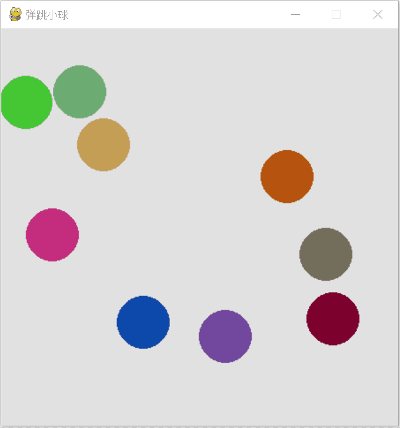

# Simple Animation and Pygame

The goal of this section is to draw multiple movable rigid balls on the screen that collide and bounce off each other, to demonstrate the principle of conservation of momentum taught in middle school physics. There are many libraries in Python that can be used to implement animation, such as Tkinter introduced in the previous section. This section focuses on introducing the Pygame library.

## Pygame Library

As the name suggests, Pygame is specifically designed for video games. It provides the graphics and sound libraries needed to create games. It allows users to develop games quickly without having to write low-level code from scratch. Pygame is based on SDL (Simple DirectMedia Layer), a cross-platform multimedia library for handling video, audio, input devices, and CD-ROMs.

Pygame is not included with Python by default and needs to be installed separately. You can install Pygame using Python's package manager pip:

```bash
pip install pygame

```

Once installed, you can import the pygame module and start writing game code. We'll use a simple mini-game to introduce how to use pygame.

## Simple Game

Suppose we want to write a simple mini-game: on the screen, a ball falls randomly from the top. At the bottom of the screen, the user can control a horizontally moving paddle. If the paddle catches the ball, the ball bounces up; otherwise, the ball falls and the game ends. Here is the program for this game:

```python
import pygame
import random

# Initialize pygame
pygame.init()

# Set screen dimensions
screen_width = 600
screen_height = 400
screen = pygame.display.set_mode((screen_width, screen_height))
pygame.display.set_caption("Catch the Ball")

# Color definitions
PADDLE_COLOR = (100, 200, 100)
SCREEN_COLOR = (10, 10, 10)
BALL_COLOR = (200, 30, 30)

# Game variables
ball_radius = 15
ball_speed = 3
paddle_width = 100
paddle_height = 20
paddle_speed = 5

# Initialize paddle position (Rect object)
paddle = pygame.Rect(screen_width // 2 - paddle_width // 2, screen_height - 40, paddle_width, paddle_height)

# Initialize ball position (Rect object, for collision detection)
ball = pygame.Rect(random.randint(ball_radius, screen_width - ball_radius), 0, ball_radius * 2, ball_radius * 2)
ball_dx = random.choice([-1, 1]) * ball_speed
ball_dy = ball_speed

# Game loop flag
running = True
clock = pygame.time.Clock()

# Main game loop
while running:
    # 1. Handle events
    for event in pygame.event.get():
        if event.type == pygame.QUIT:
            running = False

    # 2. Handle user input
    keys = pygame.key.get_pressed()
    if keys[pygame.K_LEFT]:
        paddle.x -= paddle_speed
        if paddle.left < 0:
            paddle.left = 0
    if keys[pygame.K_RIGHT]:
        paddle.x += paddle_speed
        if paddle.right > screen_width:
            paddle.right = screen_width

    # 3. Update game state
    # Move ball
    ball.x += ball_dx
    ball.y += ball_dy

    # Wall collision detection
    if ball.left <= 0 or ball.right >= screen_width:
        ball_dx *= -1
    if ball.top <= 0:
        ball_dy *= -1
    
    # Paddle collision detection
    if ball.colliderect(paddle) and ball_dy > 0:
        ball_dy *= -1

    # Check if ball falls out of the bottom of the screen
    if ball.bottom >= screen_height:
        print("Game Over!")
        running = False

    # 4. Draw
    screen.fill(SCREEN_COLOR)  # Fill screen with black (clear screen)
    pygame.draw.ellipse(screen, BALL_COLOR, ball)  # Draw red ball
    pygame.draw.rect(screen, PADDLE_COLOR, paddle)  # Draw yellow-green paddle

    # 5. Update the screen display
    pygame.display.flip()
    
    # Control frame rate (60 FPS)
    clock.tick(60)

# Quit game
pygame.quit()

```

In the program above, after importing the pygame module, we first call the `init()` method to initialize it. Then, we use the `display.set_mode()` method to set the game window size.

The program defines some game constants and variables, such as the ball's color, movement speed, etc. Among them, `pygame.Rect` is a class used to store and manipulate the coordinates and dimensions of rectangular areas. This class is very useful in game development because it provides a convenient way to track the position and size of game elements (such as characters, obstacles, buttons, etc.) and can be easily used for collision detection and interface layout. We define both game objects, the ball and the paddle, as `Rect` objects.

Pygame provides functions for drawing simple shapes. For example, you can use the `draw.ellipse()` method to draw a ball, and the `draw.rect()` method to draw a rectangular paddle. When pygame draws graphics, it does not draw directly to the screen, as that would affect animation quality. It first draws all the graphics that need to be rendered into a **buffer**, and when the `display.flip()` method is called, the already-drawn graphics are displayed on the screen. This helps avoid issues like flickering and afterimages.

In the main loop of the program, it continuously checks whether the user has pressed the left or right arrow keys. If so, it changes the paddle's position accordingly. At the same time, the program constantly monitors the ball's position. If the ball collides with a wall or the paddle, its velocity is changed to make it bounce.

## Generating Random Numbers

Most programs do not require randomness; they need accurate results. However, randomness is very important for games. Users would not enjoy opening a game and seeing the exact same process every time — they crave a sense of unpredictability and novelty. This is where random numbers come into play.

The main way to generate random numbers in Python is through the built-in `random` module, which provides a variety of functions for generating random numbers. Here are some of the most commonly used features:

* `random.random()`: Returns a random floating-point number between 0 and 1, including 0 but not 1.
* `random.uniform(a, b)`: Returns a random floating-point number within a specified range defined by parameters a and b, including a but not b.
* `random.randint(a, b)`: Returns a random integer within a specified range defined by parameters a and b, inclusive of both endpoints.
* `random.choice(sequence)`: Returns a random element from a non-empty sequence.
* `random.shuffle(sequence)`: Randomly shuffles the positions of elements in a sequence.
* `random.sample(population, k)`: Selects k unique random elements from a population sequence or set.

```python
import random

# Define a list
my_list = ['apple', 'banana', 'cherry', 'date', 'elderberry', 'fig', 'grape']

# Shuffle the list using random.shuffle
random.shuffle(my_list)

# Print the shuffled list
print("Shuffled list:", my_list)

# Use random.sample to randomly select 3 items
selected_items = random.sample(my_list, 3)

# Print the selected items
print("Selected items:", selected_items)

```

Running the program above will show different results each time.

## Multiple Balls in Motion

Let us return to the original problem of this section: "Draw multiple movable rigid balls on the screen that collide and bounce off each other." Since there are multiple balls, we can define a Ball class that contains all the properties and methods of a ball, then make each ball an instance.

Another tricky aspect is how the velocities change after two balls collide. Their speed magnitudes, directions, and collision positions may all differ. If we only use simple rules like in the example above, the ball movement would look very unrealistic. Therefore, in the program, we define some vector operations. Their purpose is: when two balls collide, decompose each ball's velocity into two vectors — one component along the line connecting the ball centers, and the other perpendicular to that line. Assuming all balls have equal mass, according to the law of conservation of momentum, the components of the two balls along the line connecting the centers should be swapped, while the components perpendicular to that line remain unchanged. After performing the above calculations, each ball's two motion components are converted back into components along the x and y axes, and the simulation continues.

The program is as follows:

```python
import pygame
import sys
import math
import numpy as np
import random

# Initialize Pygame
pygame.init()

# Set display screen size
SCREEN_WIDTH, SCREEN_HEIGHT = 450, 450
screen = pygame.display.set_mode((SCREEN_WIDTH, SCREEN_HEIGHT))
pygame.display.set_caption("Bouncing Balls")  # Window title

# Define Ball class
class Ball:
    def __init__(self, screen, position, speed):
        self.screen = screen  # Drawing surface
        self.position = np.array(position, dtype=float)  # Position (x, y)
        self.speed = np.array(speed, dtype=float)        # Velocity (vx, vy)
        self.radius = 30  # Ball radius
        # Ball color, randomly generated
        self.color = (random.randint(0, 255), random.randint(0, 255), random.randint(0, 255))

    # Check if ball hits boundary
    def hit_boundary_check(self):
        # If ball hits left or right boundary
        if self.position[0] + self.radius >= SCREEN_WIDTH:
            self.speed[0] = -abs(self.speed[0])
        elif self.position[0] - self.radius <= 0:
            self.speed[0] = abs(self.speed[0])
            
        # If ball hits top or bottom boundary
        if self.position[1] + self.radius >= SCREEN_HEIGHT:
            self.speed[1] = -abs(self.speed[1])
        elif self.position[1] - self.radius <= 0:
            self.speed[1] = abs(self.speed[1])

    # Update ball position
    def update(self):
        self.hit_boundary_check()  # Check if ball hits boundary
        self.position += self.speed # Move

    # Draw ball to screen
    def draw(self):
        pygame.draw.circle(screen, self.color, self.position.astype(int), self.radius)  # Draw ball on screen


# Collision detection and handling function
def hit_others_check(a, b):
    # Calculate distance between ball centers
    dist_vec = a.position - b.position
    dist = np.linalg.norm(dist_vec)
    
    # If the distance between balls is less than the sum of their radii, they have collided
    if dist <= a.radius + b.radius:
        # Calculate collision normal direction (line connecting centers)
        normal = dist_vec / dist
        
        # Calculate relative velocity
        relative_velocity = a.speed - b.speed
        
        # Calculate projection of relative velocity onto the normal
        velocity_along_normal = np.dot(relative_velocity, normal)
        
        # If velocities are moving apart, no handling needed (avoid sticking)
        if velocity_along_normal > 0:
            return

        # Simple conservation of momentum (assuming equal mass): swap velocity components along the normal
        # Essentially each bounces off the other
        a.speed -= velocity_along_normal * normal
        b.speed += velocity_along_normal * normal


balls = []  # Create 9 ball instances with initial positions and velocities
balls.append(Ball(screen, [100, 100], [3, 0]))
balls.append(Ball(screen, [100, 200], [-2, -2]))
balls.append(Ball(screen, [100, 300], [0, 3]))
balls.append(Ball(screen, [200, 100], [-1, -2]))
balls.append(Ball(screen, [200, 200], [-2, -1]))
balls.append(Ball(screen, [200, 300], [0, 3]))
balls.append(Ball(screen, [300, 100], [1, 2]))
balls.append(Ball(screen, [300, 200], [4, 4]))
balls.append(Ball(screen, [300, 300], [2, 1]))

number_balls = len(balls)
clock = pygame.time.Clock()

# Main game loop
while True:
    for event in pygame.event.get():
        # Exit the game if the close window button is clicked
        if event.type == pygame.QUIT:
            pygame.quit()
            sys.exit()

    # 1. Physics calculation
    # Check collisions between balls and update velocities
    for i in range(number_balls):
        for j in range(i + 1, number_balls):
            hit_others_check(balls[i], balls[j])

    # Update all ball positions
    for i in range(number_balls):
        balls[i].update()

    # 2. Draw
    # Fill the entire screen background with white
    screen.fill((225, 225, 225))

    # Draw all balls
    for i in range(number_balls):
        balls[i].draw()

    # 3. Refresh screen display
    pygame.display.flip()

    # Control frame rate (30 FPS)
    clock.tick(30)

```

The program output looks roughly like this:


