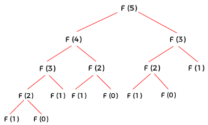

# Recursion

Recursion is a fundamental programming technique in which a function calls itself, either directly or indirectly. Problems suited for recursive solutions can typically be broken down into subproblems. These subproblems share the exact same structure as the original problem but are smaller in scale.

In mathematics, induction is a powerful proof method, and recursion can be thought of as its programmatic equivalent. The core strategy of recursion is to divide a large, complex problem into smaller, similar instances, and solve them progressively until reaching a base scenario. 

While any recursive algorithm can theoretically be rewritten using loop structures, recursion can significantly reduce code complexity, shorten development time, and improve readability. For example, implementing tree traversals, quicksort, or solving the Tower of Hanoi using loops requires manually maintaining a [Stack data structure](deque)—which is far more verbose and error-prone than writing a simple recursive function. Thus, mastering recursion is a valuable skill.

## Calculating Factorial

Let's look at the classic introductory example: calculating a factorial. The factorial of a positive integer $n$ (written as $n!$) is the product of $n$ and all positive integers smaller than it. For instance, $3! = 3 \times 2 \times 1 = 6$, and $6! = 6 \times 5 \times 4 \times 3 \times 2 \times 1 = 720$. 

To calculate a factorial using a loop, we multiply all integers from 1 to $n$:

```python
def factorial(n):
    result = 1
    for i in range(1, n+1):
        result *= i
    return result

print(factorial(5))  # Output: 120
```

Alternatively, we can express factorials inductively. The factorial of 6 can be computed by taking the factorial of 5 and multiplying it by 6. Mathematically, this is defined as:
* $0! = 1$
* $n! = n \times (n-1)!$ for $n \geq 1$

Here is the recursive implementation in Python:

```python
def factorial(n):
    # Base case
    if n == 0:
        return 1
    # Recursive case
    else:
        return n * factorial(n-1)

print(factorial(5))  # Output: 120
```

When designing any recursive algorithm, you must clearly define two paths:
* **Base Case**: The termination condition. When the function hits the base case, it returns a value directly without making further recursive calls. Every recursive function needs at least one base case to prevent infinite recursion.
* **Recursive Case**: The path where the function calls itself with a reduced version of the original problem, moving closer to the base case with each step.

In the code above, `n == 0` is the base case (returning `1`), and the `else` block is the recursive case.

## Calculating the Fibonacci Sequence

While calculating a factorial is simple, the Fibonacci sequence provides a better showcase for recursion.

The sequence was introduced by Italian mathematician Leonardo Fibonacci to model rabbit population growth:
* You start with a single pair of newborn rabbits.
* At the end of the second month, they become mature and fertile.
* Each month, every fertile pair produces one new pair.
* Rabbits never die.

The monthly population sequence is defined by this recurrence relation:

$$
\begin{aligned}
F(0) &= 0 \\
F(1) &= 1 \\
F(n) &= F(n-1) + F(n-2), \quad \text{for } n \geq 2
\end{aligned}
$$

Because the mathematical definition is written as an induction, it translates naturally into a recursive function:

```python
def fibonacci(n):
    if n <= 1:
        return n
    else:
        return fibonacci(n - 1) + fibonacci(n - 2)

# Test
n = 10
for i in range(n):
    print(fibonacci(i), end=" ")
```

Running this code prints the first 10 Fibonacci numbers: `0 1 1 2 3 5 8 13 21 34`. 

While this code is correct and simple, it has a severe performance flaw. If you pass an input larger than 30, execution slows down drastically. 

To see why, trace the execution of `fibonacci(5)`:
* To calculate `F(5)`, it calls `F(4)` and `F(3)`.
* To calculate `F(4)`, it calls `F(3)` and `F(2)`. Notice that `F(3)` is now scheduled to be calculated twice along different branches of the execution tree.
* As the call tree grows, the redundant calculations multiply exponentially.

We can visualize this call stack as a binary tree:



Because of these redundant calculations, the time complexity of this algorithm is $O(2^n)$ (more precisely, $O(1.618^n)$, where $1.618$ is the golden ratio $\varphi$). Every increase of `n` by 1 nearly doubles the execution time.

Here are a few ways to optimize this recursive process.

### Recursion with Caching (Memoization)

Since the inefficiency comes from calculating the same values repeatedly, the most straightforward fix is to store the result of each calculation. Before executing a recursive step, check if the result is already in the cache. If it is, return it directly; if not, calculate it, store it in the cache, and then return it:

```python
cache = {}

def fibonacci(n):
    if n in cache:
        return cache[n]
    if n <= 1:
        return n
    else:
        result = fibonacci(n - 1) + fibonacci(n - 2)
        cache[n] = result
        return result

# Test
n = 38
for i in range(n):
    print(fibonacci(i), end=" ")
```

Adding a lookup check to the cache ensures that each Fibonacci number is computed exactly once, turning an exponential $O(2^n)$ algorithm into a linear $O(n)$ one.

Caching results is a common strategy in programming. In Python, you do not even need to write the caching logic manually; you can use built-in tools like the [memoization decorator](decorator#caching-function-results) to automate it.

### Avoiding Tree Recursion

Another optimization is restructuring the recursion so it makes only one self-call per step, avoiding a branching call tree. 

We can do this by passing the accumulating results as arguments to the next recursive call, similar to how a loop accumulates values. The function takes two accumulators, `a` and `b`, representing the two previous values in the sequence ($F(k+1)$ and $F(k)$):

```python
def fibonacci(n, a, b):
    if n <= 0:
        return b
    else:
        return fibonacci(n - 1, a + b, a)

# Test
n = 10
for i in range(n):
    print(fibonacci(i, 1, 0), end=" ")
```

This single-branch approach is highly efficient ($O(n)$ time complexity and minimal stack frame overhead). However, because it mirrors a loop rather than the standard mathematical induction formula, it is less intuitive.

### Closed-Form Formula

While Fibonacci serves as a great teaching tool for recursion, in production you should use the most efficient method available. The Fibonacci sequence has a closed-form algebraic formula (Binet's formula):

$$
F(n) = \frac{{\varphi^n - (1 - \varphi)^n}}{{\sqrt{5}}}
$$

where $\varphi$ is the golden ratio $\frac{1 + \sqrt{5}}{2}$.

In Python, this can be calculated in $O(1)$ constant time:

```python
import math

def fibonacci(n):
    phi = (1 + math.sqrt(5)) / 2
    fib_n = round((phi**n - (1 - phi)**n) / math.sqrt(5))
    return fib_n

n = 10
for i in range(n):
    print(fibonacci(i), end=" ")
```

### 1/89

As a side note, the number 89 is the 12th Fibonacci number, and its reciprocal $1/89$ has a fascinating decimal representation:

$$
1/89 = 0.011235955...
$$

The sequence of digits starts as: `0`, `1`, `1`, `2`, `3`, `5`... forming the beginning of the Fibonacci sequence. This is not a coincidence, but a mathematical consequence of the sequence's generating function.

## Indirect Recursion

Indirect (or mutual) recursion occurs when two or more functions call each other in a cycle. Here is a basic example of two functions calling each other:

```python
def functionA(n):
    if n <= 0:
        return
    print(f"From functionA: {n}")
    functionB(n-1)

def functionB(n):
    if n <= 0:
        return
    print(f"From functionB: {n}")
    functionA(n-2)  # Decreases by a different step to ensure termination

functionA(10)
```

Here, `functionA` calls `functionB`, which in turn calls `functionA` with a smaller value, continuing until the base condition `n <= 0` is reached.

### Recursive Descent Parser

A practical application of mutual recursion is writing a compiler parser for arithmetic expressions. Let's write a simple parser that supports:
* Positive integers.
* Basic operators: `+`, `-`, `*`, `/`.
* Parentheses: `( )`.
* Well-formed syntax without spaces.

Evaluating an expression like `30+8*(13-5)/6` can be accomplished using mutually recursive functions:

```python
# Handle addition and subtraction
def process_add_sub(s):
    # Parse the higher-precedence multiplication/division terms first
    value, pos = process_mul_div(s)
    # Process addition/subtraction operators at the same precedence level
    while pos < len(s) and (s[pos] == '+' or s[pos] == '-'):
        next_value, next_pos = process_mul_div(s[pos+1:])
        value = value + next_value if s[pos] == '+' else value - next_value
        pos += next_pos + 1
    return value, pos

# Handle multiplication and division
def process_mul_div(s):
    # Parse numbers and parenthesized terms first
    value, pos = process_number(s)
    while pos < len(s) and (s[pos] == '*' or s[pos] == '/'):
        next_value, next_pos = process_number(s[pos+1:])
        value = value * next_value if s[pos] == '*' else value / next_value
        pos += next_pos + 1
    return value, pos

# Handle numbers and parentheses
def process_number(s):
    # If the current character is a digit, parse the full integer
    if s[0].isdigit():
        i = 1
        while i < len(s) and s[i].isdigit():
            i += 1
        return int(s[0:i]), i
    # If it is a parenthesis, recursively parse the sub-expression inside it
    if s[0] == '(':
        value, pos = process_add_sub(s[1:])
        return value, pos + 2  # Skip past the closing parenthesis
    return process_add_sub(s)

# Entry point
def parse_and_eval(s):
    value, _ = process_add_sub(s)
    return value

# Test
expr = "3+5*2"
print(parse_and_eval(expr))  # Output: 13 (5*2 is evaluated first)

expr = "(3+5)*2"
print(parse_and_eval(expr))  # Output: 16 (parenthesized term evaluated first)
```

This parsing structure is known as a **recursive descent parser**:
* `parse_and_eval()` is the entry point, calling `process_add_sub()`.
* `process_add_sub()` handles addition and subtraction, calling `process_mul_div()` for terms.
* `process_mul_div()` handles multiplication and division, calling `process_number()` for factors.
* `process_number()` handles numbers or recursively loops back to `process_add_sub()` if it encounters a parenthesis.

> [!NOTE]
> The above code uses string slicing for simplicity, which is computationally expensive. In production parsers, you should maintain a single pointer index to track the current character in the expression string, avoiding duplicate string allocation.

## Recursion vs. Loops

Any algorithm written with recursion can be converted to a loop, and vice versa. Some functional programming languages do not support loops at all and rely entirely on recursion, while early versions of BASIC did not support recursive calls. 

When choosing between them in Python, consider these trade-offs:

* **Performance**: Loops are almost always more efficient than recursion in Python. Every recursive call creates a new stack frame in memory to track local variables, which incurs substantial overhead. 
* **Stack Limits**: Python limits recursion depth (default is 1000) to prevent stack overflows. Even if you optimize your code using tail recursion, Python does not optimize tail calls, meaning deep recursions will still crash. Loops, by contrast, can run indefinitely.
* **Clarity**: Recursion is highly intuitive for processing hierarchical or branch-based structures, such as directories, trees, graphs, combinatorics, and divide-and-conquer algorithms. In these cases, writing a loop requires manually managing a stack list, resulting in far more complex and error-prone code.

**Guideline**: Use loops for linear calculations and large datasets. Use recursion for nested, hierarchical, or naturally branching data structures.

## Exercises

**Using recursive algorithms**, write programs for the following:

1. **Array Sum**: Calculate the sum of all numbers in a list of real numbers.
2. **Maximum in a List**: Find the largest element in a list. For example, input `[1, 4, 2, 9, 7]`, output `9`.
3. **Check Palindrome**: Check whether a string is a palindrome. For example, input `"radar"`, output `True`; input `"hello"`, output `False`.
4. **Reverse a List**: Reverse the order of elements in a list.
5. **Power Calculation**: Compute $x^n$ ($n$ is an integer) using only the four basic arithmetic operations (addition, subtraction, multiplication, division).
6. **Greatest Common Divisor (GCD)**: Implement the Euclidean algorithm (where $GCD(a, b) = GCD(b, a \pmod b)$).
7. **Permutations**: Given a list of unique numbers, return all permutations. For example, input `[1, 2, 3]`, output: `[[1, 2, 3], [1, 3, 2], [2, 1, 3], [2, 3, 1], [3, 1, 2], [3, 2, 1]]`.
8. **Array Flattening**: Flatten a nested list. For example, input `[1, [2, [3, 4]], 5]`, output `[1, 2, 3, 4, 5]`.
9. **Chessboard Path Counting**: Count the paths from the top-left to the bottom-right corner of an $m \times n$ grid, moving only right or down. For a $3 \times 3$ grid, the answer is 6.
10. **Generate Parentheses**: Generate all possible combinations of $n$ pairs of well-formed parentheses. For $n=3$, output: `["((()))", "(()())", "(())()", "()(())", "()()()"]`.
11. **Tower of Hanoi**: Solve the classic Tower of Hanoi puzzle, returning the steps to move $n$ disks from the first peg to the third peg while ensuring smaller disks always stack on top of larger ones.
12. **Eight Queens Problem**: Place eight queens on an $8 \times 8$ chessboard such that no two queens threaten each other.
13. **Maze Pathfinding**: Find a path from start to end in a 2D grid maze.
