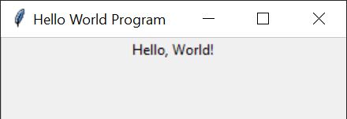

# Graphical User Interface and Tkinter

A Graphical User Interface (GUI) is a user interface that allows users to interact with electronic devices through graphical icons and visual indicators, rather than purely text-based command-line operations. Creating a graphical user interface involves adding various elements such as windows, icons, buttons, menus, images, and text boxes to a program, which certainly increases complexity. However, GUIs allow users to interact with computers in an intuitive way, greatly facilitating the user experience.

When it comes to building graphical user interfaces in Python, the first library to consider is Tkinter. This is Python's standard GUI library, providing a quick and simple way to create graphical applications. It is a built-in GUI library in Python, so Python developers can use it directly without installation.

Tkinter is a Python interface that wraps Tcl/Tk. Tcl is a widely used scripting language, while Tk is a cross-platform GUI toolkit. The Tkinter library makes it easy for Python programmers to create programs with a graphical user interface, and its style adapts to the operating system it runs on, giving the program a native look and feel. Using Tkinter, you can easily create common GUI elements such as windows, buttons, labels, text entry fields, sliders, and more. These elements are called "widgets," and each can have its appearance and behavior customized, while also being combined with each other to build complex interfaces.

Below, we demonstrate how to create a graphical user interface. Creating a GUI means you can no longer use a web-based Python development environment; the example programs below need to run in your local Python environment.

## Creating a Window

We can write a simple "Hello, World!" program using Tkinter. It creates a new window and displays a line of text on it:

```python
import tkinter as tk

# Create a new window
root = tk.Tk()

# Set window title
root.title("Hello World Program")

# Create a label widget with text "Hello, World!"
label = tk.Label(root, text="Hello, World!")

# Place the label widget on the window
label.pack()

# Run the event loop, waiting for user interaction
root.mainloop()

```

The code above first imports the tkinter module. Then, it creates a new Tkinter window object called root and sets its title. Next, it creates a label widget and sets its text to "Hello, World!". The label widget is specifically for displaying text.

By calling the label's `pack()` method, the label is added to the window, and its size and position are automatically configured. Finally, the `mainloop()` method starts the Tkinter event loop, waiting for user interaction (such as clicking the close button). This is the standard structure of a Tkinter application.

The program runs as follows:



## Widget Layout

In Tkinter, there are several ways to arrange widgets. The most commonly used layout managers are `pack()`, `grid()`, and `place()`.

* **pack()** is the simplest layout manager. It "packs" widgets into their parent container (here, the parent container is the window) in the order they are added, automatically stacking them along the top, bottom, left, or right edges of the main window.
* **grid()** arranges widgets in rows and columns. This is ideal for designing table-like layouts.
* **place()** positions a widget at an exact coordinate specified by the user.

Which layout manager to choose typically depends on the specific requirements and the complexity of the interface. In practice, these three layout managers can be mixed and matched as needed, but **only one layout method can be used within the same parent container** (for example, you cannot use both `pack()` and `grid()` on different child widgets within the same Frame — this will cause the program to freeze or throw an error). However, you can place a sub-container (such as a Frame) that uses `pack()` layout inside a window that uses `grid()` layout, thus combining different layout strategies.

Here is an example program that uses different layout managers to place multiple widgets in different positions on the window:

```python
import tkinter as tk

# Create main window
root = tk.Tk()
root.title('Tkinter Layout Managers')

# Calculate window position to center it
window_width = 600
window_height = 400
screen_width = root.winfo_screenwidth()
screen_height = root.winfo_screenheight()
center_x = int(screen_width/2 - window_width / 2)
center_y = int(screen_height/2 - window_height / 2)

# Set window size and position
root.geometry(f'{window_width}x{window_height}+{center_x}+{center_y}')

# 1. Use pack() layout
label1 = tk.Label(root, text='Packed Label (Top)', bg='lightblue')
label1.pack(side='top', fill='x')

# Create a Frame container, inside which we will use grid()
frame = tk.Frame(root, borderwidth=2, relief='sunken')
frame.pack(side='top', padx=5, pady=5)

# 2. Use grid() layout inside the Frame
label2 = tk.Label(frame, text='Grid Label (Row 0, Col 0)')
label2.grid(row=0, column=0, padx=5, pady=5)

label3 = tk.Label(frame, text='Grid Label (Row 0, Col 1)')
label3.grid(row=0, column=1, padx=5, pady=5)

label4 = tk.Label(frame, text='Grid Label (Row 1, Col 0-1)')
label4.grid(row=1, column=0, columnspan=2, padx=5, pady=5)

# 3. Use place() for absolute positioning
# Create an entry widget
entry = tk.Entry(root)
entry.place(x=50, y=200)

# Create a button
button1 = tk.Button(root, text='Placed Button (Abs)')
button1.place(x=200, y=200)

# Use place() for relative positioning (relative to parent container)
button2 = tk.Button(root, text='Relatively Placed Button (Center)')
button2.place(relx=0.5, rely=0.8, anchor='center')

# Run the event loop, waiting for user interaction
root.mainloop()

```

In the program above, a window is first created, then its dimensions are set and it is centered on the screen. Several different widgets are then created, including a Frame, labels, buttons, and an entry field, placed at various positions on the window. Within the Frame, additional widgets can be arranged.

## User Events

In a graphical user interface, the most common user operations are typing text into an input field or clicking a button. The program responds to user actions through callback functions — that is, functions that handle user events (callback functions) are bound to specific user events. Once an event is triggered, the system automatically calls the corresponding callback function.

```python
import tkinter as tk

def handle_user_input():
    # Get the content entered by the user in the input field
    user_input = entry.get()
    
    # Use the obtained content for processing; here, display it in a label
    result_label.config(text=f"You entered: {user_input}")

# Create main window
root = tk.Tk()
root.title('User Input Processing Example')
root.geometry('300x200')

# Create an entry widget
entry = tk.Entry(root)
entry.pack(pady=10)

# Create a button that processes user input on click
# The command parameter binds the callback function
submit_button = tk.Button(root, text="Submit", command=handle_user_input)
submit_button.pack(pady=10)

# Create a label to display the result
result_label = tk.Label(root, text="Please enter content")
result_label.pack(pady=10)

# Start the Tkinter event loop
root.mainloop()

```

Running the program above pops up a window containing a text entry field, a label, and a button. After the user enters text and clicks "Submit," the entered content is displayed on the label. This is a simple user input processing flow. The Button displays "Submit," and when the user clicks the button, the `handle_user_input` function is called.
In the `handle_user_input` function, `entry.get()` retrieves the content of the entry field, then updates the `text` property of `result_label` to display the entered text.

We can also bind callback functions to mouse events on widgets. For example, the program below detects whether the mouse has moved over the button. Once it does, the button is immediately moved to another position, making it impossible to click:

```python
import tkinter as tk
import random

# Create main window
root = tk.Tk()
root.title("Teasing Button")
root.geometry('600x400')  # Larger window so the button has more room to move

# Function to move the button
def move_button(event):
    # The event parameter contains detailed info about the triggering event, such as mouse position
    button_width = button.winfo_width()
    button_height = button.winfo_height()
    
    # Ensure the button doesn't move outside the window boundary
    max_x = root.winfo_width() - button_width
    max_y = root.winfo_height() - button_height
    
    new_x = random.randint(0, max(0, max_x))
    new_y = random.randint(0, max(0, max_y))
    
    button.place(x=new_x, y=new_y)

# Create a button to move
button = tk.Button(root, text="Catch me!")
button.place(x=50, y=50)  # Initial position

# Bind the mouse entering button event (<Enter>) to the move_button function
button.bind('<Enter>', move_button)

# Start the event loop
root.mainloop()

```

## Simple Animation

Continuously changing a widget's position can make it move, just like the moving button in the example above. We can also set a timer to move the widget at regular intervals, so it can move automatically even without user interaction.

```python
import tkinter as tk

# Create main window
root = tk.Tk()
root.geometry('600x400') 

# Create a button to move
button = tk.Button(root, text="Auto Run")
button.place(x=50, y=50)  # Initial position

# Function to auto-move the button
def auto_move_button():
    # Get current button position
    current_x = button.winfo_x()
    current_y = button.winfo_y()

    # Update button position
    new_x = current_x + 5
    if new_x < root.winfo_width() - button.winfo_width():
        button.place(x=new_x, y=current_y)
    else:
        button.place(x=0, y=current_y)  # Reset if it reaches the boundary

    # Call this function again every 50ms to create a loop
    root.after(50, auto_move_button)


# Call the function once before the event loop starts to kick off the loop
root.after(50, auto_move_button)

# Start the event loop
root.mainloop()

```

The author recently received a task assigned by his son: to draw several movable rigid balls on the screen that collide and bounce off each other, to demonstrate the principle of conservation of momentum taught in middle school physics. This can be done using a program similar to the example above to draw and move the balls. Since the moving object is not a widget, we need to draw the ball on a Canvas widget and then move it. The Canvas is specifically designed for drawing, providing various methods for drawing simple lines and shapes. The program below is the author's initial homework:

```python
import tkinter as tk

# Initialize main window
root = tk.Tk()
root.title('Bouncing Ball')
root.geometry('600x400')

# Create a canvas
canvas = tk.Canvas(root, bg='white')
canvas.pack(fill=tk.BOTH, expand=True)

# Create a ball (x1, y1, x2, y2)
ball = canvas.create_oval(10, 10, 60, 60, fill='blue', outline='white')

# Set ball movement speed
speed_x = 3
speed_y = 3

# Update ball position
def move_ball():
    global speed_x, speed_y

    # Get the ball's current position (x1, y1, x2, y2)
    coords = canvas.coords(ball)
    
    # Ensure the window hasn't been closed
    if not coords:
        return

    ball_left, ball_top, ball_right, ball_bottom = coords

    # Check if hitting window edge
    # winfo_width() gets the actual width, might need update() to be accurate; simplified here
    canvas_width = canvas.winfo_width()
    canvas_height = canvas.winfo_height()

    if ball_left <= 0 or ball_right >= canvas_width:
        speed_x = -speed_x  # Bounce horizontally
    if ball_top <= 0 or ball_bottom >= canvas_height:
        speed_y = -speed_y  # Bounce vertically

    # Move the ball
    canvas.move(ball, speed_x, speed_y)

    # Use the after method to set the ball movement interval in milliseconds
    # 10ms corresponds to approximately 100 FPS
    root.after(10, move_ball)


# Start the ball movement
# Note: add a short delay to wait for window initialization, so canvas dimensions are correct
root.after(100, move_ball)

# Start main loop
root.mainloop()

```

Running this program, you will find that although the ball moves as expected, the effect is not good — there is obvious flickering and afterimages. This is because Tkinter was not designed for high-performance animation. Overall, Tkinter is suitable for quickly building common graphical user interfaces, but not for handling games or complex animations. We need to consider other methods, such as using [pygame](pygame).
